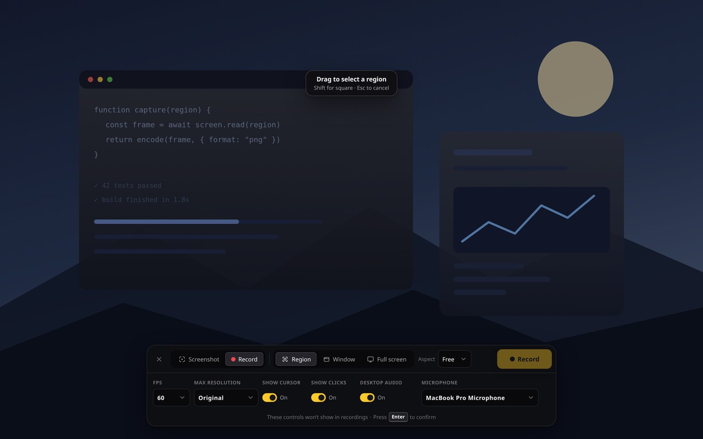
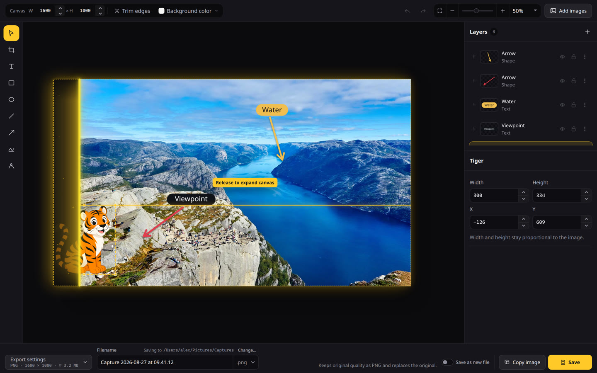
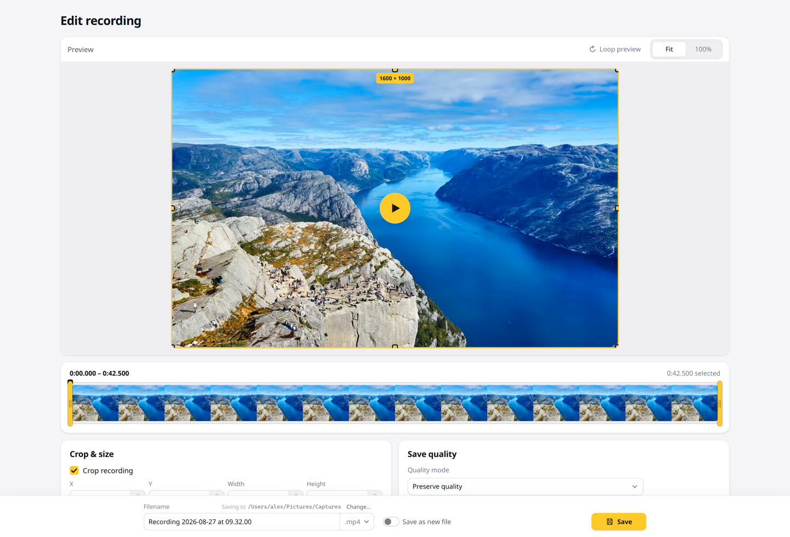
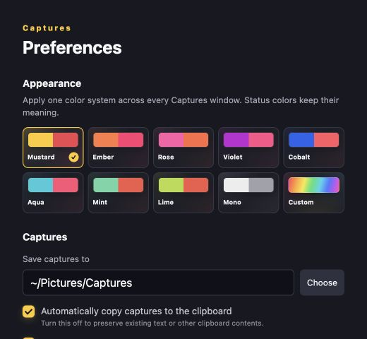

# Captures

Captures is a cross-platform screen capture utility built for quick captures and a lightweight workflow.

> [!WARNING]
> Experimental and under active development. See platform status below.

## A quick look

<table>
  <tr>
    <td width="50%">
      
       
      <strong>Capture what you need</strong>. A region, a window, or the full display. Screenshot and record from the same menu.
    </td>
    <td width="50%">
      
       
      <strong>Built-in editor</strong>. Add text, arrows, and shapes right after you capture.
    </td>
  </tr>
  <tr>
    <td width="50%">
      
       
      <strong>Polish recordings</strong>. Preview, trim, crop, and export video with quality and audio controls.
    </td>
    <td width="50%">
      
       
      <strong>Fully customizable</strong>. Light or dark appearance, accent colors, shortcuts, and capture defaults.
    </td>
  </tr>
</table>

## Download Captures Preview

These links always download the **latest** validated Preview:

| Platform | Download |
| --- | --- |
| macOS 13+ (Apple silicon) | [Captures-macOS-Apple-Silicon.dmg](https://github.com/joswayski/captures/releases/download/preview/Captures-macOS-Apple-Silicon.dmg) |
| Windows 11 (x64) | [Captures-Windows-x64-setup.exe](https://github.com/joswayski/captures/releases/download/preview/Captures-Windows-x64-setup.exe) |
| Ubuntu / Debian (x64) | [Captures-Linux-x64.deb](https://github.com/joswayski/captures/releases/download/preview/Captures-Linux-x64.deb) |
| Other Linux (x64 AppImage) | [Captures-Linux-x64.AppImage](https://github.com/joswayski/captures/releases/download/preview/Captures-Linux-x64.AppImage) |

Preview builds update after every successful merge to `main` and may contain bugs or incomplete features. Installed copies can update in the app; the notice lists every Preview published since the version you have, then installs the latest. Installing closes open captures; unsaved edits are kept as drafts and stay in Capture History. If an update download fails, the error stays on screen so you can screenshot it. GitHub 403s are often a short rate limit, and Try again usually works. If the download is missing (404), use **download from captur.es** on the error, or the installer links above. Older dated builds stay in the [build archive](https://github.com/joswayski/captures/releases).

## Features

- Capture regions, windows, or full displays
- Draw a region from an empty screen (no pre-sized outline); lock to common aspect ratios, or hold Shift for a square
- Optional auto-start after selecting a region, window, or full display (Preferences)
- Optional freeze while choosing a region or window, so hover states, menus, and motion stay put (on by default; turn off in Preferences to select from the live desktop)
- Optional countdown before screenshots and recordings
- Region recordings keep the selected area highlighted on screen while recording
- Record as H.264 MP4, with desktop audio and microphone. Save or export as MP4, GIF, or WebM
- Pause, resume, restart, and mute while recording
- Cursor and click highlights in recordings (where supported)
- Built-in screenshot editor — text, shapes (drag the rotate handle above a selected shape for a smooth spin, or use the curved angle stops for common rotations), drawing with optional drop shadows, crop (drag from outside the canvas to reach an edge; hold Shift to lock aspect), layers that hang off the canvas stay clipped until you expand, erase to transparent; unsaved edits restore when you reopen
- Trim, crop, resize, and adjust audio in recordings, with an estimated saved size and an in-editor before/after compression comparison (Hide on the overlay, or switch back to Preserve quality)
- Default screenshot save format PNG, JPEG, or WebP (Capture History stays lossless PNG until you save); export with Tiny through Highest quality presets and an in-editor before/after comparison while Export settings are open. Hide the comparison or close Export settings to edit without the slider; save quality stays Compress or Maximum until you change it
- Mini previews for quick copy, save, and drag into other apps. Hide the stack to a corner chip when it covers the desktop; a new capture brings it back
- Screenshots during an active recording
- 30-day capture history, filtered by screenshots, video, or GIF
- Light, dark, or system appearance across every Captures window
- Customizable shortcuts and accent colors
- Capture UI and capture actions stay disabled while the desktop session is locked or inactive
- Optional in-app feedback (never includes your captures)
- After an unexpected quit, Preview may send a crash diagnostic (app version, OS, and a redacted panic or OS crash summary) through the same feedback channel; it never includes captures or home-directory paths

## Wishlist

- Scrolling capture for content larger than the screen
- On-device text recognition (OCR)
- Repeat the previous capture area
- Pinned captures that stay above other windows
- Editable click highlights and keystroke overlays after recording
- Hosted sharing with shareable `captur.es/<id>` links
- Faster recording on Windows and Linux

## Platform status

| Platform | Status |
| --- | --- |
| macOS 13+ | Supported; primary development target |
| Windows 11 | Supported; experimental |
| Linux X11 | Supported; hide recording controls manually when needed |
| Linux Wayland | Experimental; no window targeting, cursor capture, or click highlights |

## Shortcuts

Defaults follow each platform’s built-in screenshot keys. Captures-only actions keep extra shortcuts.

### macOS

| Default shortcut | Action |
| --- | --- |
| `Cmd`+`Shift`+`Space` | Open New Capture |
| `Cmd`+`Shift`+`4` | Capture a region |
| `Cmd`+`Shift`+`W` | Capture a window |
| `Cmd`+`Shift`+`3` | Choose a display for a full-screen screenshot |
| `Cmd`+`Shift`+`5` | Record the screen, then save video or GIF |
| `Esc` | Cancel an active capture, screenshot countdown, or recording countdown |

### Windows

| Default shortcut | Action |
| --- | --- |
| `Ctrl`+`Shift`+`Space` | Open New Capture |
| `Win`+`Shift`+`S` | Capture a region |
| `Alt`+`PrtScn` | Capture a window |
| `PrtScn` | Choose a display for a full-screen screenshot |
| `Win`+`Alt`+`R` | Record the screen, then save video or GIF |
| `Esc` | Cancel an active capture, screenshot countdown, or recording countdown |

### Linux (GNOME / Ubuntu)

| Default shortcut | Action |
| --- | --- |
| `PrtScn` | Open New Capture |
| `Super`+`Shift`+`S` | Capture a region |
| `Alt`+`PrtScn` | Capture a window |
| `Shift`+`PrtScn` | Choose a display for a full-screen screenshot |
| `Ctrl`+`Shift`+`Alt`+`R` | Record the screen, then save video or GIF |
| `Esc` | Cancel an active capture, screenshot countdown, or recording countdown |

Global capture shortcuts can be changed in Preferences. Installations still on earlier factory defaults (`Ctrl`+`Shift` or the shared macOS-style number keys) are updated automatically; custom shortcuts stay as they are.

On macOS, overlapping Screenshot app shortcuts (`Cmd`+`Shift`+`3` / `4` / `5`) are unbound immediately so those keys reach Captures instead of the system overlay; restore them in System Settings → Keyboard → Keyboard Shortcuts → Screenshots if you want both. On GNOME, overlapping screenshot keybindings are cleared when `gsettings` is available. On Windows, Print Screen is turned off for Snipping Tool when Captures uses that key; `Win`+`Shift`+`S` may still open Snipping Tool until you change it in Windows keyboard settings. Opening Captures from the Start menu waits for Start and Search to close before the overlay freezes the desktop, so those flyouts do not appear in the screenshot.

While selecting a capture region, pick an aspect ratio in the capture menu or hold
`Shift` for a square. In the screenshot editor, zoom with the header slider and
`+`/`-` controls, pinch or `Ctrl`/`Cmd`+scroll, pan with `Ctrl`/`Cmd`-drag or
middle-click, hold `Shift` while dragging a corner handle to scale
proportionally, and duplicate layers with `Ctrl`/`Cmd`+`D`. Header W×H resizes
the canvas. Hover a layer that hangs off an edge to preview the clipped part
and expand. Locked layers keep size and position until unlocked; layer width
and height stay proportional.

## Development

See [DEVELOPMENT.md](DEVELOPMENT.md) for local setup, validation, and packaging.

## License and trademarks

The source code is licensed under the [Apache License 2.0](LICENSE).

The Captures name and logo are governed by the [Captures Trademark Policy](TRADEMARKS.md) and are not licensed under the Apache License 2.0.
