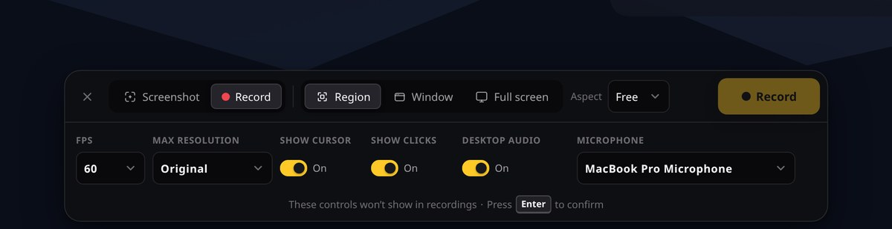

# Captures

Captures is a cross-platform screen capture utility built for quick captures and a lightweight workflow.

> [!WARNING]
> Experimental and under active development. See platform status below.

## A quick look

Open one compact menu to switch between screenshots and recordings, then choose a region, window, or full display.

  
   
  <strong>Everything in reach</strong> with capture type and target controls together in one compact menu.

<table>
  <tr>
    <td width="50%">
      
       
      <strong>Edit screenshots</strong> with annotations, layers, canvas controls, and flexible export options.
    </td>
    <td width="50%">
      
       
      <strong>Polish recordings</strong> with preview, trimming, crop and size controls, and export options.
    </td>
  </tr>
  <tr>
    <td colspan="2" align="center">
      
       
      <strong>Make it yours</strong> with a light or dark appearance, accent colors, shortcuts, and capture and recording defaults.
    </td>
  </tr>
</table>

## Download Captures Preview

These links always download the **latest** validated Preview:

| Platform | Download |
| --- | --- |
| macOS 13+ (Apple silicon) | [Captures-macOS-Apple-Silicon.dmg](https://github.com/joswayski/captures/releases/download/preview/Captures-macOS-Apple-Silicon.dmg) |
| Windows 11 (x64) | [Captures-Windows-x64-setup.exe](https://github.com/joswayski/captures/releases/download/preview/Captures-Windows-x64-setup.exe) |
| Ubuntu / Debian (x64) | [Captures-Linux-x64.deb](https://github.com/joswayski/captures/releases/download/preview/Captures-Linux-x64.deb) |
| Other Linux (x64 AppImage) | [Captures-Linux-x64.AppImage](https://github.com/joswayski/captures/releases/download/preview/Captures-Linux-x64.AppImage) |

Preview builds update after every successful merge to `main` and may contain bugs or incomplete features. Older dated builds stay in the [build archive](https://github.com/joswayski/captures/releases).

## Features

- Capture regions, windows, or full displays
- Draw a region from an empty screen (no pre-sized outline); lock to common aspect ratios, or hold Shift for a square
- Optional auto-start after selecting a region or window (Preferences)
- Optional countdown before screenshots and recordings
- Record as H.264 video or GIF, with desktop audio and microphone
- Pause, resume, restart, and mute while recording
- Cursor and click highlights in recordings (where supported)
- Built-in screenshot editor — text, shapes, drawing, crop (drag from outside the canvas to reach an edge; hold Shift to lock aspect), layers, erase to transparent; unsaved edits restore when you reopen
- Trim, crop, resize, and adjust audio in recordings, with an estimated saved size and before/after compression preview
- Export PNG, JPEG, or WebP with compression options, including a PNG color slider and before/after preview
- Mini previews for quick copy, save, and drag into other apps
- Screenshots during an active recording
- 30-day capture history, filtered by screenshots, video, or GIF
- Light, dark, or system appearance across every Captures window
- Customizable shortcuts and accent colors
- Capture UI and capture actions stay disabled while the desktop session is locked or inactive
- Optional in-app feedback (never includes your captures)

## Wishlist

- Scrolling capture for content larger than the screen
- On-device text recognition (OCR)
- Repeat the previous capture area
- Pinned captures that stay above other windows
- Editable click highlights and keystroke overlays after recording
- Hosted sharing with shareable `captur.es/<id>` links
- Faster recording on Windows and Linux

## Platform status

| Platform | Status |
| --- | --- |
| macOS 13+ | Supported; primary development target |
| Windows 11 | Supported; experimental |
| Linux X11 | Supported; hide recording controls manually when needed |
| Linux Wayland | Experimental; no window targeting, cursor capture, or click highlights |

## Shortcuts

| Default shortcut | Action |
| --- | --- |
| `Ctrl+Shift+Space` | Open New Capture |
| `Ctrl+Shift+4` | Capture a region |
| `Ctrl+Shift+W` | Capture a window |
| `Ctrl+Shift+3` | Choose a display for a full-screen screenshot |
| `Ctrl+Shift+5` | Record the screen, then save video or GIF |
| `Ctrl+Shift+F` | Open Send Feedback |
| `Esc` | Cancel an active capture, screenshot countdown, or recording countdown |

Global capture and feedback shortcuts can be changed in Preferences. While
selecting a capture region, pick an aspect ratio in the capture menu or hold
`Shift` for a square. In the screenshot editor, zoom with the header slider and
`+`/`-` controls, pinch or `Ctrl`/`Cmd`+scroll, pan with `Ctrl`/`Cmd`-drag or
middle-click, hold `Shift` while dragging a corner handle to scale
proportionally, and duplicate layers with `Ctrl`/`Cmd`+`D`.

## Development

See [DEVELOPMENT.md](DEVELOPMENT.md) for local setup, validation, and packaging.

## License and trademarks

The source code is licensed under the [Apache License 2.0](LICENSE).

The Captures name and logo are governed by the [Captures Trademark Policy](TRADEMARKS.md) and are not licensed under the Apache License 2.0.
