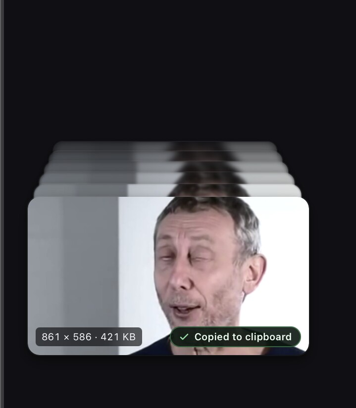

# Captures

Captures is a cross-platform screen capture utility built for quick captures and a lightweight workflow.

> [!WARNING]
> Experimental and under active development. See platform status below.

## A quick look

<table>
  <tr>
    <td width="50%">
      
       
      <strong>Capture what you need</strong>. A region, a window, or the full display. Screenshot and record from the same menu.
    </td>
    <td width="50%">
      
       
      <strong>Built-in editor</strong>. Add text, arrows, and shapes right after you capture.
    </td>
  </tr>
  <tr>
    <td width="50%">
      
       
      <strong>Keep captures handy</strong>. Collapse recent captures into a compact corner pile until you need them.
    </td>
    <td width="50%">
      
       
      <strong>Polish recordings</strong>. Preview, trim, crop, and export video with quality and audio controls.
    </td>
  </tr>
  <tr>
    <td width="50%">
      
       
      <strong>Fully customizable</strong>. Light or dark appearance, accent colors, shortcuts, and capture defaults.
    </td>
    <td width="50%"></td>
  </tr>
</table>

## Download Captures Preview

These links always download the **latest** validated Preview:

| Platform | Download |
| --- | --- |
| macOS 13+ (Apple silicon) | [Captures-macOS-Apple-Silicon.dmg](https://github.com/joswayski/captures/releases/download/preview/Captures-macOS-Apple-Silicon.dmg) |
| Windows 11 (x64) | [Captures-Windows-x64-setup.exe](https://github.com/joswayski/captures/releases/download/preview/Captures-Windows-x64-setup.exe) |
| Ubuntu / Debian (x64) | [Captures-Linux-x64.deb](https://github.com/joswayski/captures/releases/download/preview/Captures-Linux-x64.deb) |
| Other Linux (x64 AppImage) | [Captures-Linux-x64.AppImage](https://github.com/joswayski/captures/releases/download/preview/Captures-Linux-x64.AppImage) |

Preview builds automatically publish installed-app changes from `main`, and may contain bugs or incomplete features. Changes arriving during a build are grouped into the next Preview instead of waiting for an installer for every merge. Installed copies check captur.es for a new Preview shortly after launch and about every five minutes; the site caches GitHub's updater note so those checks stay off GitHub. The notice lists every Preview published since the version you have, then installs the latest. Turn **Show what’s new on update notices** off in Preferences for a compact Update now prompt. Installing still downloads the signed archive from GitHub and closes open captures; unsaved edits are kept as drafts and stay in Capture History. The update notice stays on screen during a capture so you can screenshot the changelog or an error. GitHub 403s are often a short rate limit, and Try again usually works. If the download is missing (404), use **download from captur.es** on the error, or the installer links above. You can also check from Preferences → Updates, or the tray **Check for Updates…** item. If Captures will not open or cannot install an update, download the installer for your OS from the table above. The macOS disk image, Windows setup, and Debian package replace the installed app. For the AppImage, copy it over `~/.local/bin/Captures.AppImage` and make it executable (`chmod +x`); running it from Downloads starts a second copy. Settings, capture history, and OS permissions stay. Older dated builds stay in the [build archive](https://github.com/joswayski/captures/releases).

## Features

- Capture regions, windows, or full displays. Window mode treats the menu bar, taskbar, and desktop backdrop as a full-display capture instead of a window.
- Draw a region from an empty screen (no pre-sized outline); lock to common aspect ratios, or hold Shift for a square
- Press Enter in the capture menu to confirm a screenshot or recording once a target is ready
- Optional auto-start after selecting a region, window, or full display (Preferences). Draw a region, click a window, or click the desktop in Full screen mode to start; with auto-start off, confirm with Enter or the capture button
- Optional freeze while choosing a region or window, so hover states, tooltips, menus, and motion stay put (on by default; turn off in Preferences to select from the live desktop)
- On macOS, frozen display previews and region/display screenshots convert the display color profile to sRGB; colors outside the sRGB gamut remain limited by the current capture pipeline.
- Optional cursor in screenshots (on by default; freeze screen does not include the pointer by itself)
- Optional countdown before screenshots and recordings
- Region recordings keep the selected area highlighted on screen while recording
- Record as H.264 MP4, with desktop audio and microphone. Save or export as MP4 or GIF; WebM export is not supported
- Pause, resume, restart, and mute while recording
- On macOS and Windows, recording controls stay out of screenshots and recordings by default (Preferences). On Linux, use Hide controls during a recording to keep the bar off-screen
- Cursor and click highlights in recordings (where supported)
- Built-in screenshot editor — closed shapes start filled, with an optional stroke; text, shapes, images, and drawings can rotate from a shared handle (hold Shift to use a configurable snap increment); text and drawings with optional drop shadows (color, opacity, blur, and offset; the whole label, including a background plate), crop (drag from outside the canvas to reach an edge; hold Shift to lock aspect), layers that hang off the canvas stay clipped until you expand, erase to transparent; unsaved edits restore when you reopen
- Open PNG, JPEG, WebP, GIF, MP4, and WebM files with Captures from Finder, File Explorer, or your file manager. Captures appears in Open With and does not become the default app for those types. Installed macOS, Windows, and Debian packages register this; an AppImage needs a desktop entry with `%U`. Save can overwrite the file you opened
- Trim, crop, resize, and adjust audio in recordings, with an estimated saved size and an in-editor before/after compression comparison (Hide on the overlay, or switch back to Preserve quality)
- Default screenshot save format PNG, JPEG, or WebP (Capture History stays lossless PNG until you save); export with Tiny through Highest quality presets and an in-editor before/after comparison while Export settings are open. Hide the comparison or close Export settings to edit without the slider; save quality stays Compress or Maximum until you change it
- Mini previews for quick copy, save, and drag into other apps. Minimize the stack into a corner pile when it covers the desktop; click the pile to expand it, drag the pile to move it out of the way, and a new capture shows the pile again if capture hid it. Choose a default screen corner in Preferences (bottom left unless you change it). Near the top of the screen the pile fans and opens downward, with Show less on that edge; near the bottom it fans and opens up. On the right, Show less sits on the right of the stack so it stays on the screen edge. With two or more expanded previews, Clear all dismisses the stack; saved files and Capture History stay
- Screenshots during an active recording
- 30-day capture history, filtered by screenshots, video, or GIF
- Light, dark, or system appearance across every Captures window
- Customizable shortcuts and accent colors. Find a setting in Preferences with `Cmd`+`F` on macOS or `Ctrl`+`F` on Windows and Linux
- Capture UI and capture actions stay disabled while the desktop session is locked or inactive
- Optional in-app feedback (never includes your captures)
- After an unexpected quit, Preview may send a crash diagnostic (app version, OS, and a redacted panic or OS crash summary) through the same feedback channel; it never includes captures or home-directory paths. An in-app update restart, normal logoff, or shutdown is not a crash.

## Optional cloud accounts — in development

Local screenshots, GIFs, and recordings never require an account. The website
shows an unavailable notice at `/account`; sign-in and account creation are not
available. A provider-independent users table is retained in PostgreSQL for
future development. Hosted uploads, sharing, and browser or desktop sign-in are
not implemented yet.

## Wishlist

- Scrolling capture for content larger than the screen
- On-device text recognition (OCR)
- Repeat the previous capture area
- Pinned captures that stay above other windows
- Editable click highlights and keystroke overlays after recording
- Hosted sharing with shareable `captur.es/<id>` links
- Faster recording on Windows and Linux

## Platform status

| Platform | Status |
| --- | --- |
| macOS 13+ | Supported; primary development target |
| Windows 11 | Supported; experimental |
| Linux X11 | Supported; hide recording controls manually when needed |
| Linux Wayland | Experimental; no window targeting, cursor capture, or click highlights. Mini previews cannot poll the pointer, so the stack stays interactive and may cover apps underneath |

These statuses describe the downloadable Tauri Preview.

## Shortcuts

Defaults follow each platform’s built-in screenshot keys. Captures-only actions keep extra shortcuts.

### macOS

| Default shortcut | Action |
| --- | --- |
| `Cmd`+`Shift`+`Space` | Open New Capture |
| `Cmd`+`Shift`+`4` | Capture a region |
| `Cmd`+`Shift`+`W` | Capture a window |
| `Cmd`+`Shift`+`3` | Choose a display for a full-screen screenshot |
| `Cmd`+`Shift`+`5` | Record a region |
| `Cmd`+`Shift`+`Option`+`W` | Record a window |
| `Cmd`+`Shift`+`Option`+`3` | Choose a display to record full screen |
| `Esc` | Cancel an active capture, screenshot countdown, or recording countdown |

### Windows

| Default shortcut | Action |
| --- | --- |
| `Ctrl`+`Shift`+`Space` | Open New Capture |
| `Win`+`Shift`+`S` | Capture a region |
| `Alt`+`PrtScn` | Capture a window |
| `PrtScn` | Choose a display for a full-screen screenshot |
| `Win`+`Alt`+`R` | Record a region |
| `Ctrl`+`Shift`+`Alt`+`W` | Record a window |
| `Ctrl`+`Shift`+`Alt`+`3` | Choose a display to record full screen |
| `Esc` | Cancel an active capture, screenshot countdown, or recording countdown |

### Linux (GNOME / Ubuntu)

| Default shortcut | Action |
| --- | --- |
| `PrtScn` | Open New Capture |
| `Super`+`Shift`+`S` | Capture a region |
| `Alt`+`PrtScn` | Capture a window |
| `Shift`+`PrtScn` | Choose a display for a full-screen screenshot |
| `Ctrl`+`Shift`+`Alt`+`R` | Record a region |
| `Ctrl`+`Shift`+`Alt`+`W` | Record a window |
| `Ctrl`+`Shift`+`Alt`+`3` | Choose a display to record full screen |
| `Esc` | Cancel an active capture, screenshot countdown, or recording countdown |

Global capture shortcuts can be changed in Preferences. In Preferences, `Cmd`+`F` on macOS or `Ctrl`+`F` on Windows and Linux finds a setting; `Enter`, `F3`, or `Cmd`/`Ctrl`+`G` moves to the next match. Installations still on earlier factory defaults (`Ctrl`+`Shift` or the shared macOS-style number keys) are updated automatically; custom shortcuts stay as they are.

On macOS, overlapping Screenshot app shortcuts (`Cmd`+`Shift`+`3` / `4` / `5`) are unbound immediately so those keys reach Captures instead of the system overlay; restore them in System Settings → Keyboard → Keyboard Shortcuts → Screenshots if you want both. On GNOME, overlapping screenshot keybindings are cleared when `gsettings` is available; on KDE, Spectacle’s rectangular-region shortcut is cleared when `kwriteconfig` is available. On Windows, Print Screen is turned off for Snipping Tool when Captures uses that key, and `Win`+`Shift`+`S` is intercepted so Snipping Tool does not open. If another screenshot tool still opens on the same shortcut, `Esc` always cancels Captures — even when that other overlay has keyboard focus or the freeze-frame has not finished painting. Captures lives in the menu bar or tray after setup (on Windows, look in the taskbar overflow if the icon is hidden). Open Captures from Start, Search, or the app icon to show Preferences, including Capture History. Capture from a shortcut, the tray **New Capture** item, or a tray capture action. If a capture starts while Start or Search is still open, Captures waits for those flyouts to close so they are not frozen into the screenshot.

While New Capture is open, the region, window, and display screenshot or recording shortcuts switch that overlay in place. They do not dismiss the menu or bring Preferences and other windows forward. Press the same screenshot shortcut again to freeze the capture menu into the next snapshot. An already-open region or window overlay does the same: the shortcut freezes that overlay instead of tearing it down, so you can capture Captures with Captures.

While selecting a capture region, pick an aspect ratio in the capture menu or hold
`Shift` for a square. In the screenshot editor, zoom with the header slider and
`+`/`-` controls, pinch or `Ctrl`/`Cmd`+scroll, pan with `Ctrl`/`Cmd`-drag or
middle-click, hold `Shift` while dragging a corner handle to scale
proportionally, and duplicate layers with `Ctrl`/`Cmd`+`D`. Header W×H resizes
the canvas. Hover a layer that hangs off an edge to preview the clipped part
and expand. Locked layers keep size and position until unlocked; layer width
and height stay proportional.

## Development

See [DEVELOPMENT.md](DEVELOPMENT.md) for local setup, validation, and packaging.
The downloadable Preview uses Tauri and React for its UI, with Rust engines and
platform-specific integrations for capture, recording, and media processing.

A browser-free native replacement is planned for macOS, Windows, and Linux,
developed feature by feature across platforms using shared Rust logic and the
Captures design. Development workbenches include Swift/AppKit on macOS and an
experimental Rust/wgpu renderer candidate for Windows/Linux. They are not
replacement downloads. An opt-in native capture workspace connects full-display
PNG capture, local screenshot history, copy, export, and deletion to
shared Rust engines. Its History uses the shipping card grid, header, filters and
empty states; Delete all asks for a second click, removes all capture types
regardless of the selected filter, and keeps exported files and recovery drafts.
It uses separate development data; Wayland capture is gated
until the candidate can hide its window reliably. Native Preferences saves
appearance, custom colors, and capture/media defaults through shared Rust logic
in a separate development settings file. Fresh native profiles show the shipping
setup screen before capture or opening queued media. macOS offers explicit Screen
Recording and optional Microphone access, Settings links, and a permission restart;
Windows/X11 show screen capture as ready and do not require upfront screen access. Setup does not enable Wayland capture.
Finishing setup, or a hidden launch into the menu bar or tray, briefly shows a
"Captures is ready to use" notice with the New Capture shortcut.
The native workspace now applies
automatic copy, output folder, PNG/JPEG/WebP save-format, screenshot countdown,
and cursor inclusion preferences. Cursor rendering matches the shipping app:
system cursor pixels on macOS, a synthetic arrow on Windows/X11. Escape cancels
a pending capture even with another app focused. Both the macOS workspace and
Windows/X11 candidate connect region draw/move/resize, aspect constraints, freeze,
and auto-start to shared Rust capture logic. Window selection uses the same Rust
targeting and pixel-source policy, with window/desktop confirmation, freeze/live
selection, countdown and cancellation. Real desktop, mixed-DPI and accessibility
acceptance is still open; private-X11 tests check saved region/window pixels and
simulated session cancellation. Both native hosts connect screenshot mini previews
with Copy, Save/Reveal, Edit and nondestructive Dismiss, respecting the four
corner placements and capture-inclusion preference. Multiple captures remain in
a stack with expand/collapse, scrolling with Show older/newer edge cues and Clear
all; dismissing previews leaves
history and exports intact. Expanded cards now use the Tauri layout: full-bleed
images and idle dimensions, hover-only corner icons and centered Copy/Save actions,
with controls mirrored for right-side placement. Hover dims the image; blur,
editor-presence pills and animated transitions remain open.
After export, Show in Folder selects the saved file in the file manager (on Linux
through the desktop's FileManager1 service, or by opening its folder when none
answers) instead of saving another copy; a missing export leaves the capture available.
Edit opens that screenshot directly without reopening a hidden workspace or
changing the selected History item; opening it again preserves its pending edits.
Trash moves only the saved export to the OS trash, then dismisses its preview;
an unsaved preview is only dismissed. Private History stays intact. Failed Trash
keeps the preview available for retry. macOS may request Finder automation permission;
physical Finder/Recycle Bin acceptance remains open.
Drag a collapsed pile within its capture display;
its session position survives expansion and new captures without activating the
workspace. Hovering the collapsed front card fans the rear cards outward; pressing
and dragging keeps the fan open. macOS follows Reduce Motion; the Windows/Linux
candidate reads the desktop animation preference at startup and when the workspace
regains focus. Linux requires a portal exposing the reduced-motion setting;
`--reduced-motion` can force it when that setting is unavailable.
Expanded native screenshot previews can offer the original file to another app
as a COPY. An accepted external drop dismisses only its source card; cancellation
and in-app drops retain it. A self-drop briefly shakes the card unless reduced
motion is enabled. Unsaved captures use retained temporary files cleaned on the
next startup; saved exports are never removed by drag cleanup. X11 transfers and
the isolated Wayland protocol are tested on disposable desktops. Physical macOS,
Windows OLE, mixed-DPI and full Wayland capture-host acceptance remain open.
Cross-display movement, automatic top/bottom anchor changes,
3D fan styling, stagger and the remaining preview effects are still unconnected.
Rear cards use fixed-glass depth shading; front and idle expanded images stay unshaded.
Live native hosts expose menu-bar/tray New Capture,
screenshot, History, Preferences, output-folder and Quit actions, plus configured
New Capture and region/window/display screenshot and recording global shortcuts. New Capture opens shared
Screenshot and Record controls for Region, Window and Full screen, retaining selections when
switching targets with the toolbar. While these controls are open, the configured
region/window/display shortcuts switch mode and target in the same session; keyboard
Full screen does not auto-start capture. Focused Preferences and capture
preparation/countdown and active recording suppress those shortcuts. While recording controls are hidden, only the
configured New Capture shortcut remains active so it can restore the same take. Native Preferences can edit all seven capture
and recording shortcuts. Recording keys open the selector without starting a take. Linux requires
a StatusNotifier tray host; without one,
closing the window quits instead of leaving an unreachable background process.
Native Record creates H.264 MP4 using the stored recording defaults and supported
audio options. Its compact controls support pause/resume, confirmed restart with
the stored countdown, microphone mute/unmute, stop/save to development History,
and discard. Running mute changes durably complete the current segment before
continuing with the same target and options; paused changes do not resume. Restart
replaces only the current take and resets its elapsed time. Both native HUDs show
live microphone level while visible, running, and unmuted, clearing it when paused,
muted, hidden, or changing the take. Physical microphone and device acceptance
remain open. Hide removes only the controls, shows a temporary
noninteractive notice, and preserves the session, timer, pause and microphone state. The menu bar/tray,
app reactivation, and configured New Capture shortcut restore the controls; Linux disables Hide without a
usable tray and restores the controls and workspace if its tray host disappears. FFmpeg and FFprobe must
be installed separately for these development builds; native media-tool bundling
is not connected. Started recordings are saved on session loss instead of being
discarded; failed finalization retains recovery data. Linux cannot exclude the
controls from captured pixels, so Hide is the native workaround on X11. Shared
native recovery can identify, assemble, or explicitly discard interrupted takes
in isolated development History. Both native workbenches list interrupted recordings
separately in History, with cancellable recovery and confirmed permanent discard.
Unavailable bundles remain read-only for manual inspection; failures allow retry,
and cancellation cannot undo a recording already published to History. This is
interrupted capture recovery, not persistent recording-editor drafts or an
installed-data migration.
Region recordings keep a click-through boundary and dimming outside the recorded
area during countdown, recording, pause, and hidden controls. The guide leaves
the recorded pixels transparent and disappears when the take ends or is cancelled.
The recording HUD can open a region screenshot selector without pausing or replacing
the accepted take. Escape cancels only that selector or its screenshot countdown;
successful screenshots use the normal native History, preview and auto-copy paths.
AppKit and Windows can exclude native capture UI. X11 temporarily hides the HUD and
guide from the screenshot, but cannot keep the selector out of the ongoing recording.
As in the Preview, a take that cannot start keeps the HUD open with the error and
offers **Retry recording** or Delete. A resume that cannot reopen the microphone
leaves the take paused so it can still be saved.
The Windows/Linux candidate's **Edit recording** opens a decoded frame preview
with source-relative scrubbing, draggable trim handles, numeric trim/crop controls, custom output dimensions
and MP4/GIF **Save new copy**. Crop dimensions start aspect-locked; unlock to change
width and height independently. Apply edits accepts the format, quality and edits
together before saving; failed updates leave the last accepted frame intact.
Both native editors follow the shipping layout (**Edit GIF** for GIF sources). The save
footer names the file, shows its folder with **Change…** and the .mp4/.gif format;
after a successful copy, **Show in Folder** reveals it.
The shared recording editor now also supports same-format replacement of an
existing permanent MP4/GIF when History retains identical recovery media.
Both native editors expose **Replace original…** with confirmation of the opened
session's exact saved path. The action is unavailable for recovery-only or
reference-only recordings, staged edits or a different output format; the backend
also rejects missing or divergent recovery files. Success rebases the editor and
updates the existing History item. Cancellation stops preparation but cannot undo
publication once it begins. Ordinary failure keeps accepted edits; an uncertain
result requires closing and reopening. This is not crash-atomic across the saved
file and History. **Save new copy** remains non-destructive.
Trim handles stage changes without decoding on each pointer move; Apply updates
the preview. Focused trim handles also accept arrow keys and Page Up/Page Down.
Clicking the trim track seeks the accepted preview; **Reset trim** restores the full range.
**Adjust crop** shows an uncropped source frame with draggable edges/corners and
interior move. Crop handles follow the aspect lock; arrows move one source pixel,
or ten with Shift. **Done cropping** restores the prior preview without accepting
changes; Apply remains explicit. Loading this source frame can be canceled or retried.
Both native recording editors provide **Fit / 100%**, which changes only the
displayed scale. At 100%, one decoded image pixel occupies one screen point; larger
previews scroll within the preview area. Playback
still uses its bounded decoded size, not full-source resolution.
The trim track shows retained full-source thumbnails, independent of the edited
preview. Thumbnail generation can be canceled or retried without losing edits;
it does not change the source recording. **Play/Pause** offers motion within
the accepted trim, with a preview capped at 30 fps and 1280 × 720. Pause retains
the last displayed frame; reaching the trim end makes Play restart that range.
Editing and export controls wait for playback to stop. Losing focus or minimizing
pauses playback. **Loop preview**, off by default, repeats the accepted trim until
paused. It can be switched on or off during playback and never changes the export.
**Sound**, off by default and changeable while stopped, previews the accepted MP4
audio mix on the default output device. GIF and mixes with no audible tracks stay
silent without opening a device. Device failures are visible; turn Sound off to
retry silently. Loop reopens the decoders each lap and is not gapless. Physical
audio routing and A/V synchronization acceptance remain open.
The preview identifies its accepted format/quality, and saving uses those settings.
**Save quality** offers Preserve quality (MP4 only; choosing GIF switches to Compress),
Compress with Tiny, Smaller, Balanced, High or Highest, or Maximum file size.
GIF palettes follow the preset: Tiny 64 colors, Smaller 96, Balanced 128, and
High/Highest/Preserve 256. Maximum mode keeps that palette while saving at Preserve
quality to fit the size cap; MP4 does not use it.
**Estimate size** checks those accepted settings without publishing an export.
Copied or fully encoded short ranges show exact sizes; sampled longer ranges and
audio-only Preserve changes show approximate sizes. Estimation can be canceled.
Both native recording editors show nonzero percentage changes versus the original
recording beside accepted estimates; staged edits and Maximum mode hide the delta.
Both native recording editors' **Compare** action explicitly encodes a read-only
before/after sample at the accepted frame, with a split slider, Hide, cancellation
and retry. It does not follow paused playback time or publish a file or History
entry; staged edits hide it. Maximum mode shows the first encoded attempt, not
necessarily the final capped save; output cadence may select neighboring frames.
Both native recording editors offer **Maximum file size** for MP4/GIF, using
decimal KB/MB/GB with a 100 KB minimum. Apply accepts the limit; the size label then
shows the cap instead of an estimate. Save may reduce resolution, frame rate or
audio quality to fit, so its first-attempt preview is not a promise of final output.
An unattainable limit fails without publishing a copy.
Available system and microphone tracks each have an include checkbox and 0–200%
volume, plus **Convert to mono**. Accepted settings apply to MP4 exports and Sound
preview. GIF output shows that GIFs have no audio, without discarding the MP4 settings.
Both native recording editors offer 8, 10, 12, 15 (default), 20, 24 or 30 FPS for
GIF exports. Apply accepts the frame rate with the other edits; switching to MP4
keeps the GIF choice without changing MP4 cadence.
Both native recording editors offer GIF **Maximum width** choices of 320, 480, 640,
800 (default) or 1200 px, applied after crop and output sizing without upscaling.
Changing the cap recomputes from that base; switching to MP4 restores base sizing
and remembers the GIF choice.
Original, 1080p maximum and 720p maximum output presets preserve the current crop's
aspect ratio and never upscale. Custom dimensions override the preset.
Custom dimensions are independent (no aspect lock); the shared media engine rounds
sizes to even pixels.
Re-encoded Windows/Linux MP4 fits within 3840 × 2160 (2160 × 3840 for portrait);
its preview reflects that cap, while GIF previews retain their requested dimensions.
**Save new copy** reports progress, supports cancellation, never replaces an existing
file, and adds a distinct History item. A History failure retains the saved path.
Recording edits are not drafts: save or explicitly discard them before closing or
quitting. AppKit connects a separate History editor with decoded source-relative
frames, numeric trim and source-relative crop, Original/1080p/720p or independent
custom output dimensions, accepted MP4/GIF settings, size estimation and cancellable
**Save new copy**. Available system and microphone tracks have independent 0–200%
volume and mute controls plus mono output; audio applies to MP4 while GIF disables
the controls without losing their MP4 values. Its graphical trim handles overlay an
immutable 12-frame source-relative thumbnail strip and stage the same numeric values
without seeking; loading can be canceled or retried without disabling editing, and
Apply remains explicit. Play/Pause presents bounded accepted-edit motion frames and
a source-relative playhead without changing the accepted preview, edits, History or
source. It is silent by default, with optional Sound preview of the accepted MP4 mix
on the default device; GIF and inaudible mixes stay silent without opening a device.
Optional Loop preview repeats the accepted trim without changing
exports or dirty state; each lap reopens the decoders and is not gapless.
**Adjust crop** loads one immutable full-source frame at the accepted position, then
stages source-pixel crop changes with eight resize handles or interior movement without
decoding on each pointer event. **Done cropping** restores the prior accepted or motion
frame; only Apply publishes the staged values. Loading is cancellable and retryable.
Fit or 100% applies to the accepted, paused/playback or crop-source frame without
decoding again or changing edits, estimates, exports or History; each item defaults to Fit.
Windows/X11 provide the same full-source graphical adjustment alongside numeric crop
and output sizing. This is not Tauri editor parity; physical audio routing, A/V sync,
macOS, Windows and Wayland acceptance remain open.
History displays recording posters and metadata; **Save file**
copies the original media to the output folder without re-encoding, and
**Show in Folder** reveals that saved copy. Both native
hosts offer counted All, Screenshots, Video and GIF history filters; filtering
does not delete captures or exports. After finalization, a temporary **Recording ready**
notice offers Save file, then Show in Folder after saving a permanent copy. Dismissing
or letting it expire preserves History and exports; failed saves can be retried.
Both native workbenches also render the Preview update notice (release notes,
download progress, restart countdown and errors) from a simulated status source.
Native builds cannot check for, download or install updates yet.
A screenshot History card's **Edit** opens the AppKit screenshot editor. Its first
native editor slice restores and saves isolated drafts, previews shared-Rust crop
and canvas-resize operations, and supports Undo, Redo and confirmed draft discard.
Its Layers panel connects shared visibility, lock, opacity, movement, image rename,
duplicate, delete and adjacent ordering commands while preserving locked barriers;
both native hosts also provide **Merge down**, **Merge visible**, and **Flatten image**
with undo/redo and saved-draft restoration. Merge down requires adjacent unlocked
layers; Merge visible retains hidden layers; Flatten removes hidden layers and
bakes the canvas background into one locked image.
The original History image and its exports remain unchanged until explicit replacement. Recording completion
still presents its notice immediately; opening the recording editor is a separate History action. Real macOS and
Windows recording, audio devices, multi-display and hardware acceptance remain open;
Wayland recording is gated with the rest of native capture.
Both native development hosts accept repeatable `--open-media PATH` arguments
only with `--live`; `--open-image` remains an alias in the same ordered queue.
AppKit also handles macOS file-open requests while running. PNG, JPEG and WebP
become local History-backed screenshot editor sessions. GIF, MP4 and WebM open
in the recording editor as external references, without copying or changing the
source. Unsupported files report an error without stopping later paths.
Reopening an already-open source focuses its editor without replacing unsaved
edits. Closed sources reload under the same History ID; screenshot sources with
a saved draft must first be restored or explicitly discarded from History.
AppKit switches its editor between sources only after opening settles and without
dropping pending text or unsaved edits; a refused source remains in History.
The shared backend validates the actual recording container, editor preview and
poster before publication. WebM is an input format, not a WebM export;
Preserve-to-MP4 transcodes it rather than copying WebM bytes into an MP4 file.
External recording references cannot use Replace original; that action requires
a private recovery copy and a separate permanent save. Save new copy remains available.
Live development hosts now forward subsequent launches to the process using the
same History directory, preserving file order and sender-relative paths; a launch
without files restores the native workspace/Preferences or recording controls.
Native Preferences → About offers explicit **Launch native Captures at login**
for macOS, Windows and X11 development profiles. It starts that profile hidden;
relaunch or the tray/menu bar restores it. This uses a separate user-owned login
entry, not Tauri's setting or registration. Disable it before moving/removing the
development binary. Wayland hidden startup and physical sign-in acceptance remain
open; [development setup/removal](DEVELOPMENT.md#native-development-login-items)
documents the platform entries and conflict recovery.
Fixture launches remain independent. Optional unsigned development packages provide
Open With metadata for these six formats on macOS, Windows and Linux, under a separate
**Captures Native Development** identity. Staging does not install them or change
default handlers; [local opt-in instructions](DEVELOPMENT.md#native-development-open-with)
include removal. Signing, distribution and physical file-manager acceptance remain
open; these are not replacement downloads. TIFF is supported by in-editor import,
not this external-open path.
Native Preferences (and the tray/menu bar Send Feedback…) opens an optional
feedback form in its own window, matching the shipping layout. Sending shares only
the message, optional contact, category, and displayed app/system details with
captur.es; it never attaches captures, files, or diagnostics. Fixture mode cannot
send feedback, and failed requests preserve the draft for retry.
Shared Rust now defines the screenshot editor's layered document, crop/translation/
orientation geometry, canvas sizing and bounded snapshot history, checked against
the shipping TypeScript behavior. A shared renderer now flattens real image layers
and editor shapes, including closed annotations, curved lines, tapered arrows and
freehand paths with crop geometry, rotation, opacity, blending and enabled shape/path
drop shadows, without host I/O.
A separate shared text prerequisite shapes and rasterizes single lines from explicit
font bytes, including ligatures, combining marks and right-to-left text. Shared
paragraph helpers now provide measured wrapping, alignment, auto-width boxes and
background-plate geometry. An opt-in document renderer composites filled/outlined text and
square/rounded plates from those fonts, with rotation, opacity and blending. Shared
text selection, movement and resizing follow the shipping editor's interaction rules.
Outlines use scalable monochrome glyph contours; color/bitmap glyphs return an error
in outline mode. Text shadows follow the glyphs, or the plate
when one is enabled. Editor workers can own explicit
fonts and preserve their exact bytes in local draft sidecars, so text edits, undo,
export and reopening use the same fonts. Typed commands create plain or preset text and edit
content, type, alignment, color and plates transactionally. Both native hosts now
connect a basic **Draw → Text** tool with staged Apply/Cancel controls, including
outlines and shadow color, opacity, blur and offsets. Before placement, choose a
named style, size and color; boxed styles center on the click. These defaults last
only for that editor. Both hosts start at Rounded box when its pinned font is
offered, otherwise Standard, then Plain. New text starts in the annotation red,
with an initial size scaled to the original capture (24–72). The bundle includes
Nunito and Liberation Sans, Serif and Mono (OFL 1.1); exact font
bytes and license notices stay with the draft. Older drafts offer only their saved
fonts; adding new fonts to an existing draft is not implemented.
Nunito covers fewer characters than Sans; for characters such as Greek λ, choose a
Sans-based style (Standard or Box) before typing. Missing glyphs produce an error
rather than a substitute font.
Selected-text named styles use those pinned fonts; Rounded and Rounded box are
available in new sessions, but remain unavailable in older drafts without a
saved rounded face.
In both native editors, explicitly choosing a named style for selected text also makes that
style the next new-text choice for this editor. Cancel or a failed Apply does not
undo that future choice; size, color and manual font edits do not carry forward.
The Windows/Linux candidate and AppKit host separately connect on-canvas native
multiline composing fields to the same shared transaction. Typing previews text
without saving or adding undo steps; finishing commits one edit, while Cancel
restores the previous document. The composing fields use each host's UI font and
an unrotated box, not the Tauri editor's styled inline layout. Physical macOS,
Windows, Wayland, IME and accessibility acceptance remain unverified.
This is not Tauri system-font equivalence or universal Unicode coverage:
missing glyphs remain errors, and fonts are never discovered or downloaded automatically.
Worker-owned editor sessions add draft restore/save/discard, transactional crop/
resize/lossless image transforms/undo, single decoded-RGBA image import, and retained
pixel frames for native hosts. Typed rectangle/ellipse/triangle/diamond/star, straight-line/arrow and
completed freehand-path creation are also available; native hosts still own pointer
sampling, drawing gestures and cancellation.
Shared annotation-style patches can update existing
shape/path colors, closed-shape fill/stroke controls, widths and shadow settings
without replacing documents.
The shared C boundary accepts one borrowed decoded RGBA
buffer into session-owned storage; hosts own file decoding and interaction.
Full-canvas photos rotate their canvas; layered overhang stays clipped and fully
off-canvas transformed images expand the canvas so they are not lost. Shared
interactive crop geometry also matches shipping bounds, aspect presets and Shift
locking; physical input acceptance remains separate work.
The Windows/Linux candidate opens screenshots from History in a native crop,
canvas-size and draft editor with undo/redo. Both native hosts place their scrolling
inspector to the right of the canvas and center the image in Fit mode without
upscaling small captures. Their workbench layout still differs from the shipping
Tauri editor. Both editor windows resize down to 760×540, with scrollable inspector
controls and a wrapping viewport footer on macOS. A shipping-style export bar spans
the bottom of both editors in every section: an **Export settings** disclosure whose
summary reads like `PNG · 1920 × 1080 · ≈ 240 KB`, the filename with a format suffix
menu, **Saving to** with **Change…**, **Copy image** (briefly **Copied**), a
**Save as new file** switch and **Save**. **Draw crop** selects directly on the
preview with free or preset aspect ratios and Shift ratio locking. Apply commits
the selection; Cancel or Escape leaves the document unchanged. Its layer panel supports selection,
visibility, locking, opacity, renaming, position, duplication, deletion and ordering.
**Draw** adds rectangles, ellipses, triangles, diamonds, stars, straight lines, tapered arrows and freehand Pen strokes in the default
annotation color, one undoable layer per gesture. Escape cancels unfinished work;
short arrow gestures are discarded and drafts retain completed shapes and strokes.
Both hosts use shared polygon geometry for transient previews and committed layers.
Pen smooths sampled points and retains click-only dots.
**Layers → Annotation style** edits fill, stroke and shadow color, width, opacity,
blur and offsets. Apply style creates one undo step; Reset fields cancels unapplied
changes. Hidden and locked annotations remain editable.
Image layers also expose lossless left/right rotations and horizontal/vertical
flips, including when hidden or locked; each action supports undo and draft restore.
**Import image** adds one PNG, JPEG, WebP or TIFF below the selected visible image,
expanding the canvas when needed. Imports respect EXIF orientation, are undoable,
and keep their own draft pixels so reopening does not require the source file.
Supported RGB/grayscale ICC profiles convert to sRGB; unsupported profiles and
PNG gamma/chromaticity-only or CICP metadata require conversion to sRGB first.
Export settings hold output size, save quality (Preserve, Compress or a maximum
file size) and **Est. size**, which re-encodes automatically a moment after edits
or option changes and shows the % change from the original; an encoded-output
toggle previews the result on the canvas without saving. As in the shipping app,
**Save** overwrites a screenshot's saved file by default, atomically replacing it and
updating the same History item (its date is kept) after re-checking that file and
entry. Turning on **Save as new file**, editing the filename or choosing another
folder saves a new file instead, and a format that differs from the original always
does; new files never replace an existing file and add a distinct History entry.
A capture without a saved file writes its first Save to the output folder. The saved
file then becomes what Save overwrites, and **Show in Folder** appears. If History
cannot be updated, the saved file's path remains available for recovery. The status
line under the filename explains what Save will do and warns when JPEG will fill in
transparent areas. The editable document, draft, undo and output preview are
retained; Undo affects the editor, not the saved file.
Closing can save or keep the previous draft; explicit Discard edits restores the
current History image. Failed draft saves keep edits open and cancel normal quit. Private-X11 checks
cover both appearances, persisted drafts, real preview pixels and error recovery.
AppKit now connects the same crop, canvas-resize and draft operations in its own
window. **Draw crop** also uses the shared aspect presets and Shift ratio locking;
the candidate stays separate from the document until Apply, and Cancel/Escape
restores the prior fields. Numeric crop fields and the overlay stay synchronized.
It includes native image-layer controls, lossless rotate/flip actions, and
PNG/JPEG/WebP output previews without saving. Both native export settings offer
**Tiny, Smaller, Balanced, High and Highest** compression presets alongside custom
values. Highest PNG preserves pixels with lossless packing; JPEG/WebP presets are lossy.
Both hosts also offer **Original, 75%, 50% and Custom** output dimensions, with an
aspect lock for custom sizes. Preview/save resize only the exported pixels and the
published History image; the editable document, draft and full-resolution clipboard are unchanged.
Its export bar uses the same shared save model and status copy as the
Windows/Linux candidate, and preserves the draft. AppKit
also imports one still image at a time as a new image layer using its color-managed
system decoder. It normalizes imported pixels to straight-alpha sRGB RGBA8 and retains
them in the draft without depending on the source file. ImageIO-supported sources use
their first image; files without a usable color description are rejected rather than
silently relabeled.
Its **Draw** view maps Rectangle, Ellipse, Line, Arrow and Pen gestures from the fitted
edited preview into shared document coordinates, including reverse and off-canvas
gestures. Release creates one undoable layer; Escape, focus loss, close, or leaving Draw
cancels transient geometry without editing the document. Arrow outlines and Pen
smoothing come from shared Rust; Pen supports click-only dots and round caps.
Both native editors offer stroke/fill colors, stroke width and opacity before
drawing. These choices stay local to the editor; drawing creates one undoable
layer. Pre-placement drop-shadow controls include color, opacity, blur and X/Y
offsets. While dragging an annotation, both hosts update its pixels and shadow
through the shared renderer in the background; Escape restores the unchanged image.
An approximate vector guide appears until the first pixel frame is ready.
Its Layers panel also edits annotation fill, stroke and shadow settings with an explicit
Apply style action. Unapplied fields can be reset; shared Rust owns style defaults,
rendering, undo and draft persistence.
In both native hosts, **Layers** supports clicking the edited preview to select an
unlocked visible layer, or empty space to clear selection. Drag shows a translated
selection outline; release moves the layer in one undoable edit. Escape, focus loss,
preview resizing or leaving Layers cancels the drag. Pixels update on release, not
continuously during dragging; selection alone does not change the document.
The selected layer also exposes a **rotation grip** when it fits inside the image.
Drag it to rotate; hold Shift for stops configured under **Layers → Shift rotation snap**
(1–180°, initially 15°). The increment is per-editor UI state, not a document edit
or saved preference. Rotation uses the same outline-only
preview, cancellation, undo and draft behavior. Hidden or locked layers have no
grip.
Eight border grips resize images, shapes and drawings. Shift keeps corner drags
proportional; edge grips remain single-axis. Unrotated resizes snap to canvas and
visible-layer edges with guide lines; rotated resizes retain the opposite anchor.
Resizing uses an outline-only preview and commits on release.
Canvas moves now snap painted bounds to canvas and visible-layer edges, including
locked layers, with alignment guides. The snap range stays constant on screen;
numeric X/Y edits remain exact and do not snap. Clicks and small pointer movements
do not trigger snapping or change the document.
Both hosts connect view-only zoom and pan: Fit, 100%, zoom steps, Recenter,
Cmd/Ctrl-wheel zoom and Cmd/Ctrl-drag or middle-button pan. AppKit also connects
native magnification. Zoom stays anchored under the pointer and shares the image's
coordinate mapping with editing tools. These controls do not change drafts or undo.
Fit does not enlarge small screenshots; manual zoom still can.
Cmd/Ctrl +/− zoom in 1.25× steps; Cmd/Ctrl 0 shows 100% (not Fit), including while
an editor field has focus. Zoom shortcuts cancel unfinished canvas gestures.
Cmd/Ctrl Z undoes and Cmd/Ctrl Shift Z redoes document edits outside text entry
and open dialogs. Typing retains its own Undo; commands do not queue while the
editor is busy. These are editor-local shortcuts, not global capture shortcuts.
Cmd/Ctrl D duplicates the selected layer; Delete/Backspace removes an unlocked
selection. Locked and hidden layers can still be duplicated, and typing fields
keep their own deletion keys. Arrow keys nudge an unlocked selection by one image
pixel, or ten with Shift, without snapping or expanding the canvas. Hidden layers
can be nudged too. Focused fields and zoom controls retain their arrow keys.
Cmd/Ctrl C copies the selected layer inside that editor; Cmd/Ctrl V pastes the
snapshot, even after its source is changed or deleted. Repeated pastes offset by
24 pixels and support undo/redo. This does not replace the system clipboard or
import clipboard images; **Copy image** remains the separate pixel-copy action.
Closing the editor or discarding its draft clears the internal layer clipboard.
Right-click a layer for Copy layer, Paste layer, Duplicate, Delete and Merge down.
These actions target that row; Merge visible and Flatten image affect the document.
Empty list space offers Paste and the document-wide combine actions.
Locked layers cannot be deleted or merged down.
With canvas focus, V selects layers, C starts Crop, T selects Text, R Rectangle,
O Ellipse, L Line, D Diamond, S Star, A Arrow, P Pen, and B the last-used
Wand/Erase/Restore mode (initially Wand). Switching tools cancels unfinished
gestures without applying them; selecting the same tool again preserves them.
Focused native controls retain typing and letter navigation.
Both hosts also keep a left tool rail visible beside the canvas: Select, Crop,
Text, Shapes, Arrow, Pen and background removal. Shapes opens a native menu for
Rectangle, Ellipse, Line, Triangle, Diamond and Star, recalling the last choice.
The rail and shortcuts share the existing tools; pending work disables the rail.
The zoom menu offers Fit, 50%, 100% and 200% and displays the current custom zoom.
Both hosts also provide a logarithmic 5–800% zoom slider. It tracks the actual Fit
scale and preserves the viewport-center image point when dragged.
Fit retains each workbench's existing placement.
Windows, Wayland and physical AppKit presentation remain unverified.
The native editor still uses a workbench layout, not the shipping Tauri editor design.
Native cloud sharing is not implemented. Its required flow starts from a mini-preview
Share icon and opens a native upload/settings popup, including native sign-in and OS
credential storage. The [sharing integration slice](docs/native-rewrite.md#mini-preview-sharing-integration--required-not-implemented)
remains required regardless of accounts/backend or rewrite merge order; opening a
preview never uploads automatically.
Shared Rust has an unconnected account-client prerequisite for explicit email-code
sign-in and native credential-vault sessions. It does not add a native sign-in
screen, enable the account service, or make sharing available.
Both hosts can copy the full-resolution edited image without saving a file or draft;
copy ignores export format and quality settings.
Canvas background controls support a hex color or transparency, with undo/redo and
draft restore. They change the canvas fill, not backgrounds within image layers.
**Trim edges** fits the canvas to visible layer geometry, preserving off-canvas
content and moving hidden layers with the document. It does not scan image alpha
to remove transparent borders. Trimming supports undo/redo and draft restore.
Both hosts also connect **Draw → Wand**: click an image to remove similar colors,
using a 0–255 tolerance and either a contiguous region or all matching pixels.
The frontmost visible image is editable even when locked; transparent pixels do
not let clicks reach images underneath. Each edit clears the canvas fill, keeps
the original image pixels, and supports undo/redo and draft restore. The original
History capture remains unchanged. **Erase** and **Restore** use adjustable brush
diameter and softness; Restore paints from the retained original image. The brush
ring shows size while shared-renderer pixels preview the stroke during dragging.
Release commits one undo step; Escape, focus loss or changing tools cancels the
preview without editing. The shipping brush cursor design and physical-platform
input acceptance remain parity work.
Text controls support multiline content, pinned font families, size, bold/italic,
alignment, color, square/rounded background plates, outlines and a Drop shadow toggle.
Apply changes the document in one undo step; Cancel restores accepted values.
Custom shadows and pinned-font named styles are connected, including style/size/color
choices for new text. Font import and physical input/IME/accessibility acceptance
remain open.
The native capture workspace includes a **Capture permissions** recovery dialog
(**Screen access** on macOS) that reuses the setup permission cards. Check or refresh without prompting; request macOS
screen or optional microphone access explicitly. Done returns to the workspace
even after denial or a check failure, without restarting or closing editors.
Windows/X11 need no upfront screen grant; microphone status is not reported there.
Wayland live capture remains gated. Physical permission-revocation/retry acceptance
is still open.
Post-save source adoption, remaining editor layout/interaction parity,
physical setup/login acceptance and updates remain open. Shared editor support is prerequisite work,
not native editor acceptance. Resident shortcuts and single-instance relaunch are
connected, but physical cross-platform acceptance and full feature/design parity
remain open. The
[migration checklist](docs/native-rewrite.md) tracks the plan and parity gates;
existing Preview features remain available during development. The wgpu candidate
does not yet support hidden-window idle on Wayland; see its
[evaluation limits](apps/native/wgpu/README.md).

## License and trademarks

The source code is licensed under the [Apache License 2.0](LICENSE).

The Captures name and logo are governed by the [Captures Trademark Policy](TRADEMARKS.md) and are not licensed under the Apache License 2.0.
