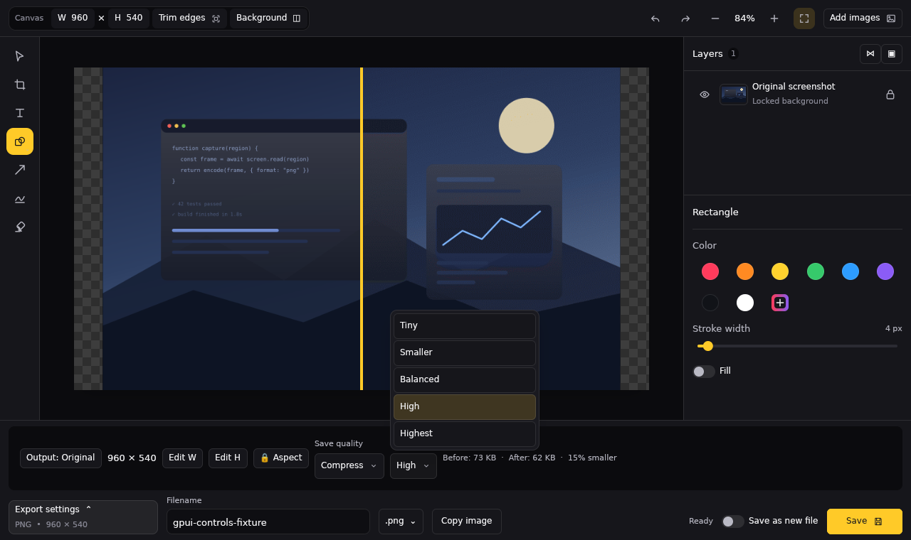
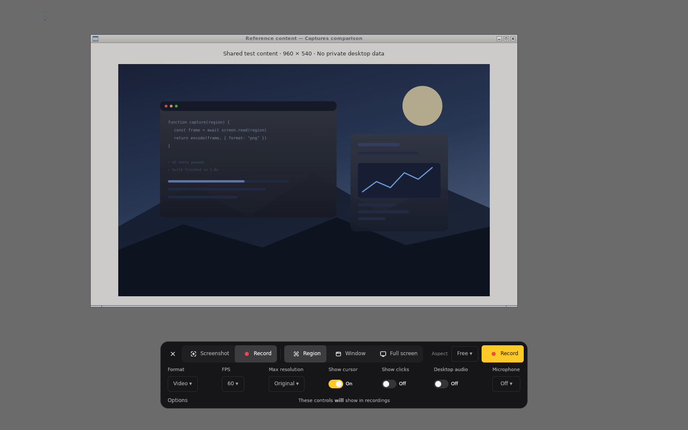
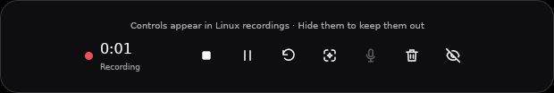
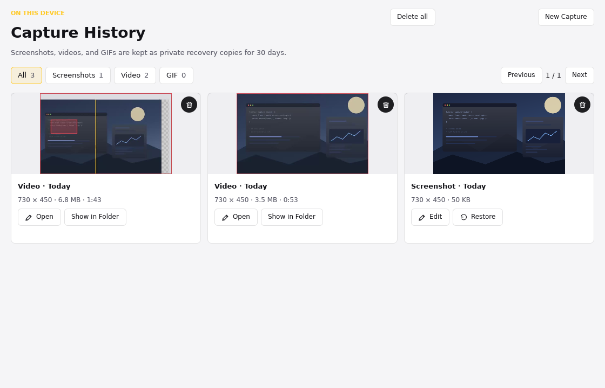

# GPUI implementation

`experiments/gpui` is a separate Rust application using published **GPUI 0.2.2**
for custom windows and GPU rendering. It reuses Captures' capture, recording,
media, and session crates, shared CSS design tokens, and editor icon geometry.
It does not embed React, a browser, or GTK widgets. Cairo rasterizes editable
image documents; FFmpeg handles media decoding and export.

**This is not yet a feature-equivalent replacement for the shipping app.** It
implements the capture/editor/recording workflow, rather than a static launcher,
but the gaps and unverified combinations below still matter. The Tauri Preview
build, installers, and update channel are unchanged. The shared UI now has native
adapters for Linux/X11, macOS, and Windows. Linux/X11 has rendered workflow checks;
macOS and Windows runtime verification remains pending. Wayland is still gated out.

## Implemented surfaces

| Surface | Behavior | Evidence and limits |
| --- | --- | --- |
| Desktop shell | Tray, eight configurable global shortcuts, private single-instance IPC, optional login startup, file opening, light/dark/system and accent settings | IPC forwarding, fragmented commands and lock release are tested. A hidden unmapped keeper window prevents GPUI 0.2.2 from exiting when its last visible window closes. GNOME/KDE tray integration still needs physical-desktop testing. |
| Capture selector | Frozen/live region, window and display targeting; region move/resize, aspect ratios, Shift square, display picker, draggable fixed-glass toolbar, screenshot/video/GIF options, countdown, auto-start and Escape | Integrated X11 check captures a real 730×450 region and independently compares every pixel. It also checks IPC reopening, lock cancellation, Escape, and zero-visible-window lifetime. Multi-monitor/HiDPI and window targeting need hardware validation. |
| Mini previews | Collapsed/expanded piles, hover controls, corner/gravity movement, rotated cached cards, blur, dismissal, confirmed deletion animation, copy/save/reveal, input-shape click-through | Live X11 Shape and native `text/uri-list` clipboard tests; bounded decoded/rotated caches; asynchronous generation-safe decoding. External file dragging to another app is **not implemented**. |
| Screenshot/canvas editor | Layered image/text/shapes/freehand, selection/transforms, crop, erase/restore/wand, undo/redo, visibility/lock/reorder/merge, custom colors, typography/shadows, transparency, zoom, private drafts, PNG/JPEG/WebP export and encoded comparison | Tests exercise real encoders, alpha, size constraints, layers, geometry and draft identity. Native text input and pointer coordinates were exercised. Full gesture, animation and accessibility equivalence is not established. |
| Recording | Countdown, xcap segments, pause/resume, microphone rollover, screenshot callback, restart/discard/quit, hide/restore controls, region guide, lock auto-pause, private manifests and recovery | Real X11 recording produced 66.298s of H.264 across two segments. The combined-app check also records 730×450, verifies all four guide bounds and preview exclusion, cancels an actual screenshot selector and resumes, auto-pauses on an isolated DBus lock event, restarts the process and recovers a probed MP4 through the UI. No session-check bypass is present. Hardware audio remains unverified. |
| Recording editor | Persistent FFmpeg frame pipe, seek/loop, draggable trim/crop with aspect lock, resizing, per-track controls, estimates/comparison, cancellable export/progress, source replacement staging | Real MP4/GIF encoding tests and pointer trim/crop checks. Old images are evicted during playback. No hardware AV-sync validation; native picker/source replacement/recovery prompts were not all exercised end-to-end. |
| Preferences/history | One scrolling settings document, anchored sidebar, Ctrl+F text search, shortcut editing, async audio-device enumeration; 30-day private history copies, filters/paging, restore, reveal and confirmed cleanup | Persisted light/dark/accent interactions and video filtering/deletion confirmation exercised. Tests cover independent recovery copies and preservation of externally saved files. Updater/feedback explicitly unavailable; interrupted-recording drafts have their own recovery UI, not history rows. |

## Data and safety

The GPUI profile uses `$XDG_DATA_HOME/captures-gpui` on Linux (normally
`~/.local/share/captures-gpui`), `~/Library/Application Support/captures-gpui`
on macOS, and `%LOCALAPPDATA%/captures-gpui` on Windows. `CAPTURES_GPUI_DATA`
overrides that location. Private storage uses owner-only Unix permissions or
Windows ACLs; settings replacement is atomic. It never
migrates or writes the Tauri or GTK experiment's settings/history. Quit other
Captures builds before testing overlapping shortcuts. The GPUI build does not
clear another application's OS shortcut assignments.

New screenshots are private lossless PNGs under `unsaved/`, with independent
history recovery copies. Capture does not automatically publish a file to the
selected output directory. Preview **Save** encodes the selected PNG/JPEG/WebP
format and publishes a new non-overwriting file. History Restore opens the recovery
copy as an unsaved preview without adding another history row. Preview dismissal,
Clear all, and unsaved-preview deletion preserve history; deleting a published
preview trashes the published file but preserves history. Confirmed history
cleanup removes private copies and private unsaved originals, never external saved
sources. Recording drafts are private and recovery validates path confinement.

Capture and recording use the shared fail-closed session gate. The test desktop
supplies an isolated `org.freedesktop.ScreenSaver` service because Xvfb has no
logind session; it does not disable the production gate. On Linux, controls can
appear in recordings: use Hide controls when needed. Window-exclusion options
cannot make X11 provide capture exclusion it does not support.

macOS recording uses the shared ScreenCaptureKit backend rather than xcap's
recording path. Screen/microphone permission requests recheck session safety
after the prompt. ScreenCaptureKit's whole-app exclusion applies when both
preview and recording-control inclusion are off; mixed inclusion cannot be
represented by this backend's current app-level filter. The AppKit sharing flag
is only a legacy best-effort hint, not a guarantee for modern capture APIs.
Windows applies native display affinity to excluded preview/control windows.
These native branches still need real desktop capture tests.

The UI remains shared: platform adapters handle tray/menu integration, shortcuts,
file clipboard/reveal, activation, login startup, and privacy. File copying uses
X11 URI targets, an AppKit file URL, or Windows `CF_HDROP`; clipboard support does
not implement cross-application dragging. Media tools resolve relative to bundles
and standard installed locations without changing PATH. Fresh profiles use the
shipping app's OS-specific shortcuts; existing custom bindings remain unchanged.

The parent integration repairs GPUI 0.2.2's forced X11 popup decorations only for
this process's notification windows. Region guides are positioned after mapping
and have empty native input regions, because initial bounds alone allow a window
manager to relocate these very thin windows. HUD button presses do not bubble
into the window-move handler. These details are checked in the real desktop,
not inferred from the GPUI element tree.

## Remaining parity and platform work

- Native cross-application XDND file dragging is missing. GPUI's in-app drag API
  is not a native drag source; clipboard support is not a substitute for it.
- WebM export returns a visible unsupported error from the shared media
  backend. MP4 and GIF export are implemented.
- Test-only native packages and PR build jobs are available through the
  [platform helpers](../experiments/gpui/platform/README.md). There is no GPUI
  distribution/update channel, feedback transport, crash diagnostics, or
  shipping onboarding/update/launch-notice workflow. macOS bundles do not yet
  advertise Finder document associations; CLI/file-URL routing is not proof of
  native Open With event handling.
- A finalized mixed audio stream cannot be split back into independent system
  and microphone tracks. Available separate tracks are handled separately;
  ffplay failure currently does not surface a warning in the editor.
- Not every React animation, reduced-motion setting, keyboard traversal,
  screen-reader semantic, or editing gesture has an equivalent verified GPUI
  implementation. This must not be advertised as exact visual/interaction parity.
- Crop gestures currently begin on the image canvas, not the surrounding gray
  viewport. Large-image responsiveness, long recordings, real audio, native save
  portals, multiple monitors, scaling, GNOME/KDE compositors and physical Linux
  desktop lock transitions need testing. Source image opening decodes asynchronously.

## Current control parity pass

Editor actions no longer include shortcut suffixes; shortcuts remain available.
Save as new file is a switch, and the primary Save action now respects format,
quality and output dimensions. Changing the source format forces a new-file
prompt instead of writing mismatched bytes into the original extension. Closed
shapes expose a Fill switch; lines/arrows do not. The color picker has one hex
field (Enter applies it) and selected swatches, without a second Apply-hex control
or a drawing-color status message. Export settings have more padding, the same
Tiny–Highest quality presets as Tauri, and an automatic draggable before/after
comparison while compression settings are open. Stale preview jobs are rejected
after edits, preset changes, or closing the panel.

The capture menu uses cursor/click/desktop-audio switches, aligned fields, and a
centered inclusion note with **will/won’t** emphasized. Linux truthfully says
**will** because compositor-level exclusion is unavailable. The inert Show keys
button was removed; the shared recorder does not implement keystroke overlays.
HUD actions use the shared SVG icons, with hover descriptions. History Edit and
Restore use aligned icon/text buttons; removal uses a trash icon and confirmation.

Native checks exercised hex entry (`#42747043`), quality selection, automatic
comparison refresh after a document edit, the new-file switch, and Ctrl+S into a
disposable PNG (decoded as 960×540). The switch alone did not modify the source.
The native new-file picker was not exercised. Capture menu variants, actual
recording HUD, and History were rendered and inspected. Properties scroll inside
the sidebar; lower color controls may require scrolling at smaller viewports.

## Updated resource comparison

September 12, 2026: the updated GPUI release versus the unchanged production
Tauri binary from the baseline below. Same two-vCPU Mesa 25 llvmpipe/X11 lab,
fresh profiles, five alternating trials per frontend, five seconds settling and
two seconds CPU sampling. Each row measures the entire application process tree.
PSS apportions shared pages, unlike summed RSS, which can count them repeatedly.

| State | Tauri PSS, MiB | GPUI PSS, MiB | Tauri CPU, % one core | GPUI CPU, % one core |
| --- | ---: | ---: | ---: | ---: |
| Preferences | 595.1 | 160.8 | 20.0 | 1.5 |
| Screenshot editor | 693.4 | 169.7 | 45.0 | 2.0 |
| Screenshot selector | 737.0 | 214.9 | 0.5 | 2.0 |
| Recording selector | 749.4 | 215.2 | 0.0 | 2.0 |
| Three collapsed previews | 914.6 | 222.1 | 5.0 | 2.0 |
| Three expanded previews | 880.2 | 221.5 | 5.5 | 2.0 |
| Active region recording | 1004.7 | 257.9 | 133.5 | 120.0 |

All values are medians. Recording CPU is **active capture**, not idle; 100% means
one fully occupied core. Recording waits for the durable `recording` state before
the common settling interval; both inspected HUDs read 0:07. The overlay rows
retain the initial Preferences window in both applications. Preview rows follow
three real 730×450 captures, verified by independent history entries. These are
application-state costs, not the incremental cost of a single menu.

Initial collapsed-stack samples were rejected: immediate synthetic clicks could
pass through Tauri before native pointer polling enabled hit testing. All five
pairs were rerun with hover/animation waits, and all ten trial screenshots were
inspected as collapsed piles. The window retains transparent space, so frame
height alone cannot establish collapse. Raw results include this provenance.

GPUI uses substantially less memory here, but does not win every metric. Idle
selectors use more CPU. Median screenshot-selector mapping took 462 ms for GPUI
versus 235 ms for Tauri; recording-selector mapping took 381 versus 301 ms.
Preferences mapped in 643 versus 1193 ms, and the image editor in 649 versus
1302 ms. **Mapping is not first useful paint.** Preview/HUD setup includes
deliberate automation waits, so its timing is not a startup comparison.

No physical-GPU, macOS, Windows, Wayland, energy, sustained playback, long-recording
or export-throughput claims follow from this run. Tauri's H.264 preview returned
`NotSupportedError` after Play despite a decoded timeline and installed GStreamer
plugins; comparing that error state to GPUI's working decoder would be invalid.
History also lacks a verified symmetric production entry path in this fixture.
Those workloads remain unmeasured, rather than extrapolated from the editor.

[Updated samples, ranges, binary hashes and environment](../experiments/gpui/results/linux-controls.json).

## Historical release resource comparison

Measured on September 11, 2026 in a two-vCPU Linux orb using Mesa 25.0.7
llvmpipe, Xvfb (1600×1000), Openbox and xcompmgr. Both applications were release
builds; Tauri embedded the production frontend with `tauri/custom-protocol`.
These measurements describe the original Linux baseline, before the subsequent
editor-parity and platform-adapter changes; they are not refreshed measurements.
Preferences used matching 980×720 client windows; image editors used 1280×760
windows with the same 960×540 fixture. Both used fresh isolated profiles, dark
appearance and software rendering. The screenshots were inspected for actual
loaded content, not merely mapped windows.

Each state had one visual warmup per frontend and five measured trials in
alternating frontend order. Memory covers the entire application process tree
after five seconds of settling; CPU is measured over the following two seconds.
Values below are medians. PSS apportions shared pages; summed RSS double-counts
pages shared between processes, so PSS is the more useful memory comparison.

| State | Frontend | PSS MiB | Private MiB | RSS MiB | Processes | First mapped window, ms | Idle CPU, % of one core |
| --- | --- | ---: | ---: | ---: | ---: | ---: | ---: |
| Preferences | Tauri | 595.3 | 440.0 | 1197.4 | 6 | 1273 | 21.0 |
| Preferences | GPUI | 161.1 | 159.0 | 167.2 | 1 | 647 | 2.5 |
| Image editor | Tauri | 698.0 | 525.2 | 1326.1 | 6 | 1335 | 44.0 |
| Image editor | GPUI | 171.4 | 169.4 | 177.3 | 1 | 646 | 1.5 |

GPUI's median PSS was 73% lower for Preferences and 75% lower for the image
editor in this fixture. **First mapped window is not first useful paint or
readiness.** These are different implementations with remaining parity gaps,
not a controlled replacement of only the rendering engine. Software-rendering
CPU and memory results must not be extrapolated to physical GPUs, battery life,
macOS, Windows, Wayland, or a full recording/editing workload. The standalone
GPUI executable is also slightly larger (37.0 MiB versus 34.4 MiB); these sizes
exclude shared libraries and media tools and are not installer sizes.

[Raw samples, ranges, environment and binary/input hashes](../experiments/gpui/results/linux-release.json)
are checked in with the measurement scripts. The source-base field identifies
the unchanged Tauri base; the GPUI implementation is the accompanying PR, not
that base commit.

### Selection motion to observed pixels

The same release binaries were sampled separately with `latency.py`, with no
competing builds or UI checks. Each frontend had two discarded warmups and ten
measured trials, each using a new process and selector. After activating the
selector and settling for three seconds, the harness presses at (320, 180),
waits 80 ms, timestamps and injects motion to (1050, 630), then polls a 13×9 root
window patch for the yellow top border. A baseline-yellow patch invalidates the
trial; five-second timeouts are failures, not fast frames. Both resulting
730×450 selections were visually inspected to verify the detector's target.

| Frontend | Successful trials | Median, ms | Min–max, ms | Nearest-rank p95, ms |
| --- | ---: | ---: | ---: | ---: |
| Tauri | 10/10 | 297.0 | 245.0–391.5 | 391.5 |
| GPUI | 10/10 | 123.0 | 77.6–142.3 | 142.3 |

Raw results: [Tauri](../experiments/gpui/results/latency-tauri.json) and
[GPUI](../experiments/gpui/results/latency-gpui.json). Median idle polling overhead
was 0.140 ms and 0.136 ms respectively. This measures the first drag motion's
**event-to-observed-software-compositor-pixel latency**, including scheduling and
polling effects, not steady-state drag FPS or physical display latency. The
80 ms pointer-down delay does not prove either input queue has drained. Tauri
trials ran first, then GPUI; unlike the resource trials, these were not interleaved.
Ten trials do not establish a reliable tail-latency distribution.

## Earlier layout and workflow evidence

The earlier layout pass introduced the shipping layout's left SVG tool rail, centered
fit canvas, right Layers/contextual-properties panel, and grouped export controls.
The following renders document that pass; the current control screenshots above
supersede its button labels, export controls, and HUD glyphs.
Pointer checks exercised the six-shape flyout, numeric Apply/Escape, export and
format menus, appearance switching, and resizing to 980×650 with properties
scrolling. The footer uses a shared 36px control height and bottom alignment.
The original eight drawing-color swatches and custom picker replace color
cycling; stroke width uses a 2–40px slider. Native checks verified exact swatch
color, drag values, Home/End, arrow adjustment without nudging a layer, and one
undo per drag. Undo returns focus to the editor when its controls disappear.

The expanded-preview Clear all / Show less row now fits its allocated width,
and its native input region follows the right-aligned controls. Show less was
clicked to verify collapse. Per-card hover actions could not be reliably
displayed in this X11 gallery run and remain unverified. The recording editor
still differs from the original layout; the GIF selector currently exposes
video-style FPS/resolution labels. These are follow-up parity gaps, not fixed
by the screenshot-editor control pass.

These are actual application screenshots, not generated design concepts.
The historical comparison pairs below place release Tauri on the left and the
original pre-parity GPUI build on the right at identical client dimensions.
They correspond to the benchmark baseline, not the updated editor above. Light
mode is an additional visual check, not another performance dataset. None of
these images establishes exact visual or interaction parity.

The integrated recording check exercised the frameless HUD and lock auto-pause.
Focused native interaction checks also exercised the custom color picker and
rotated preview pile. Their screenshots illustrate those states; the tests
and interaction checks above establish only the behaviors they actually ran.

## Verification performed

- `npm run check`: passed, including 830 desktop tests and production web builds.
  The orb run disabled inherited Git signing only for the command's disposable
  test repositories (`GIT_CONFIG_COUNT=1 GIT_CONFIG_KEY_0=commit.gpgsign
  GIT_CONFIG_VALUE_0=false`); the initial run could not sign their fixture commits.
- Root `cargo fmt --all -- --check`, `cargo test --workspace` and strict workspace
  Clippy: passed; 366 Rust tests passed, one ignored.
- GPUI locked tests: 88 passed;
  formatting, strict all-target Clippy and release build passed.
- Python helper tests: twelve passed (ten benchmark, two latency).
- The first current `npm run check` with disposable Git signing disabled hit two
  asynchronous CaptureOverlay test failures (828 passed). The complete rerun
  passed all 830 tests and the production web build; no Tauri source was changed.
- Updated `.agents/setup` ran twice successfully; warm setup completed without
  reinstalling system packages. GStreamer parsing/decoding packages are installed
  for media checks, but the Tauri H.264 preview still failed in this fixture.
- Platform helper policy, shell syntax and workflow formatting checks passed.
  Full native macOS/Windows builds and runtime checks were unavailable in the
  Linux orb; isolated exact-dependency adapter type checks do not substitute
  for the new native CI jobs or physical-desktop testing.
- `capture_check.py`: exact 730×450 pixel comparison; private history and no
  automatic publication; IPC, Escape, lock cancellation and tray lifetime;
  failed asynchronous source opening cannot expose a placeholder Save action.
- `recording_check.py`: actual region recording and guide bounds, preview
  exclusion, screenshot-cancel resume, lock-preserved segments, and process
  restart followed by recovery into a probed 730×450 MP4.

These checks ran in the isolated Linux/X11 fixture. They do not cover the
physical-desktop and product gaps listed above.

Build and repeatable test commands are in [DEVELOPMENT.md](../DEVELOPMENT.md#gpui-implementation).
