# Linux-native parity build

This experiment replaces the React/webview frontend with **Rust + GTK3 + Cairo**
while reusing Captures' Rust capture, recording, media and session crates. GTK is
a widget toolkit, not a Linux distribution or desktop requirement. GTK apps can
run outside GNOME, including KDE, when their runtime libraries are installed;
that does not guarantee identical appearance or compositor integration.

**Stacking, particles and custom interfaces do not require a webview.** The native
build now implements those interactions alongside layered image editing, embedded
recording playback, history, preferences, shortcuts and recovery. It is much more
than the original screenshot probe, but **not yet a no-regressions replacement**.
The shipping cross-platform Tauri app and its release pipeline are unchanged.
A subsequent [Windows port](windows-native-implementation.md) now shares this
frontend. Its verification is documented separately; macOS native work has not started.

## Implemented behavior and evidence

“Exercised” means real GTK input and filesystem/media checks in an isolated X11
session. Unit tests additionally cover model/encoding boundaries. Neither means
every combination has been tested on physical Linux desktops.

| Surface | Current native behavior | Evidence / remaining limits |
| --- | --- | --- |
| Capture entry points | Source-shaped fixed-glass segmented toolbar with screenshot/video/GIF targets and contextual options; tray menu, background process and single-instance routing | No additional launcher: startup opens Preferences, and capture entry points open the target selector. Global X11 screenshot key, cancellation and second invocation exercised. AppIndicator requires a compatible tray host; the orb has no GNOME/KDE panel. |
| Screenshot targeting | Region move/resize, aspect ratios, monitor picker, frozen/live screen, auto-start, countdown and cursor options; window/full-display targeting | Region move/resize produces an independently pixel-checked 380×190 crop. Window and 1280×800 display capture exercised. Physical multi-monitor/HiDPI remains unverified. |
| Mini previews | Source-sized 340px stack with 284×160 cards; four corners, receding stack/hover fan, expansion/paging, hover-only controls and image blur, metadata, click-through, file drag, non-destructive dismiss/Clear all, confirmed image-chip dust deletion | Real pointer check exercises all corners, idle/hover chrome, correct file identity on external drag, copy/close/delete, retained files and particles. Decoded sharp/blurred caches are bounded; older encoded posters remain available. GTK/Cairo compositing is not pixel-identical to browser filters. |
| Image editor | Real locked source layer; image/text/freehand/line/arrow/rectangle/ellipse/triangle/diamond/star layers; visibility/lock, rename, thumbnails, reorder, duplicate/delete/merge; opacity/blends; move/resize/rotation; crop, flip, trim/expand; undo/redo, zoom/fit/pan | Shapes, rename, layer clipboard, pan, exact undo, reverse crop and output exercised. Model tests cover transforms, lock floor, alpha, clipping and reorder. Full screen-reader coverage and automated row-drag coverage remain open. |
| Background removal | Color wand with tolerance and contiguous/global selection; soft erase and original-pixel restore; transparency checkerboard | Model tests cover removal/restore; controls and checkerboard render exercised. Output alpha is checked separately from display pixels. |
| Image output/drafts | Independent private atomic drafts and automatic reopen; explicit source Save versus named new Export; PNG/JPEG/WebP, Preserve/Compress/Maximum size, actual encoded comparison | Source remains unchanged until Save; draft reopen, source overwrite and draft removal exercised. PNG uses indexed/dithered alpha-aware quantization; JPEG uses 4:4:4 and white alpha composition; WebP uses real libwebp lossless/lossy encoding. Quality/size boundaries have discriminating unit tests. |
| Canvas / asset creation | Opaque/transparent canvas presets/custom size; same layered editor and image imports | Real alpha-preserving output and visible checkerboard exercised. This is a layer workspace, not a claim that every asset-authoring gesture matches React. |
| Recording HUD | Source-shaped compact fixed-glass pill with transparent margins, elapsed/state, pause/resume, restart confirmation, live mic mute/unmute, screenshot callback, discard, hide/restore and region guide | Real segment pause/restart/mic changes, screenshot cancel/save and preview exclusion exercised. Live microphone peak measurement is unavailable (marked in tooltip/accessibility text). Controls/guide can appear in Linux recordings; there is no reliable recording-window exclusion. |
| Recording safety/recovery | Shared fail-closed session checks; private segment manifests; recovery/discard at startup/History; non-overwriting publication | Lock auto-pause, segment preservation, retry/finalization and interrupted Video→GIF startup recovery exercised. Test lock authority is isolated DBus, not a real GNOME/KDE lock screen. |
| Video/GIF editor | Source-shaped scrolling page and persistent save bar; FFmpeg-decoded frames inside GTK and headless ffplay per audio stream; pointer/keyboard trim/playhead; source-coordinate crop handles and numeric controls; embedded draggable/keyboard comparison; selectable folder, safe named MP4/GIF export | Playback progression, direct crop/trim input, comparison movement and physical Play click, 320×200 MP4/GIF output into a chosen folder, unchanged source hash and independent audio controls exercised. Playing dismisses still comparisons. Hardware audio, AV sync/long-session performance and WebM export remain unverified/unsupported. |
| History | Source-shaped header, count filter pills, media cards and empty state; isolated 30-day index, open/reveal, restore image/GIF preview, inline two-step remove and clear | Restore/removal/clear and changing filter counts exercised; saved files survive removal/expiry. Index stores path/time, so source dimensions/duration/drop metadata and independent archived snapshots are not available. No production-library migration. |
| Preferences | Source-shaped 196px navigation and one scrolling document (Appearance, Capture, Shortcuts, Recording, GIF export, Updates, About), light/dark/system, ten accent swatches/custom colors, device selection, placement and opt-in login startup | 250ms debounced saving, persistence, selected swatches/navigation and light/dark Custom controls exercised. No staged Apply/Save footer. Native update changelog is explicitly disabled until an update channel exists; Tauri-only options absent from native Settings remain unavailable. |

Settings, history and editor drafts use `captures-linux-native` data, configurable
with `CAPTURES_NATIVE_DATA`. Recording segments live in a private
`<output>/.captures-recording-drafts/<session>` directory and survive failed
finalization. Recovery validates contained regular paths, rejects symlinks and
publishes a new file before removing the draft. Explicit discard is destructive;
ordinary preview dismissal and history removal are not.

## Before and after

These are actual renders, not generated concepts. Before Preferences/image-editor
views use the full Tauri application. Other before views use its documented React
dev harness with mock data; after views use real native GTK windows. Samples differ
except for the identical 960×540 neutral image-editor benchmark input, extracted
from the React harness's SVG fixture. No screenshot of app controls is embedded in
that input. Preview comparisons use equal 340×760 stack frames and distinct native
fixture colors to expose file-identity mistakes; they are not pixel-diff tests.

The controls refinement uses source-sized button typography, neutral borders and
subtle shadows, accent hover and keyboard-focus states, flat dropdown/numeric
fields, and custom-styled GTK switches and sliders. The gallery includes a screen
index; the image-editor check also exercises and captures Save hover/focus without
exporting. GTK menu behavior and text rasterization are still platform-native.

The final alignment pass bottom-aligns the 36px editor save controls, centers layer
text, removes doubled property-heading margins, and matches the source header and
footer padding. History Edit uses the primary accent, with destructive hover on
the 32px trash control. Collapsed preview corners now use the source X/Y offsets,
depth scale, 900px perspective and backward tilt; projection tests use independently
measured browser bounds. Native placement still snaps to four corners, rather than
reproducing the source's continuous mid-screen gravity and drag sway.

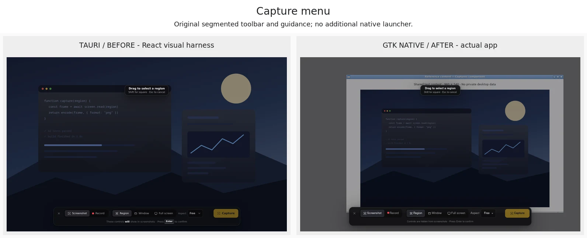
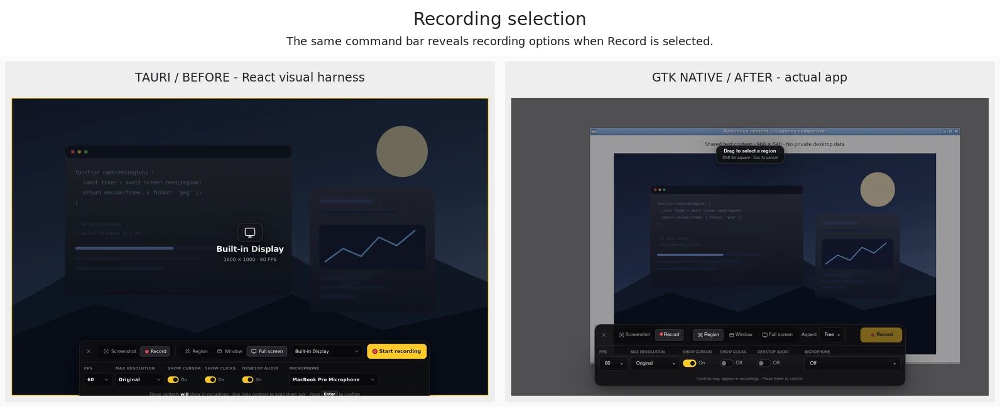
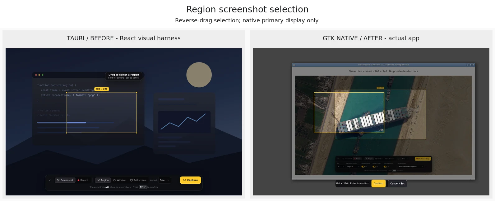
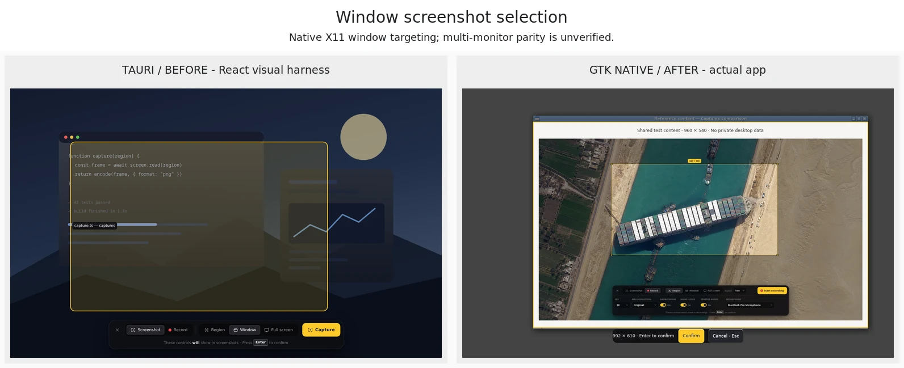
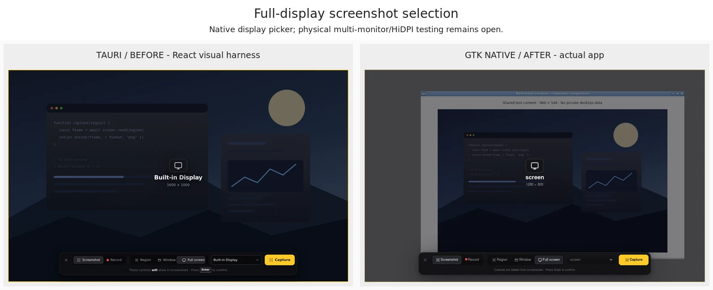
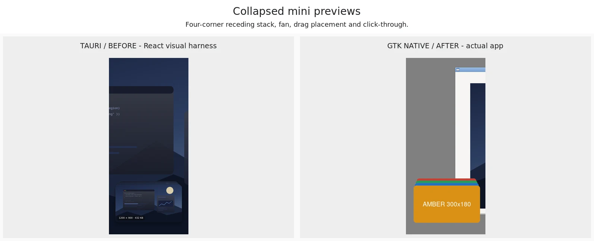
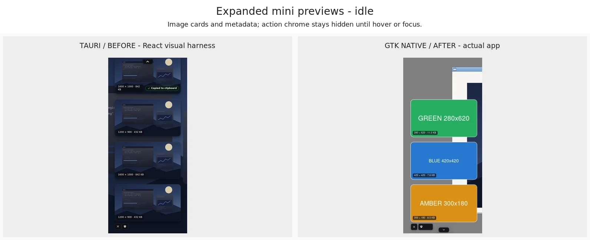
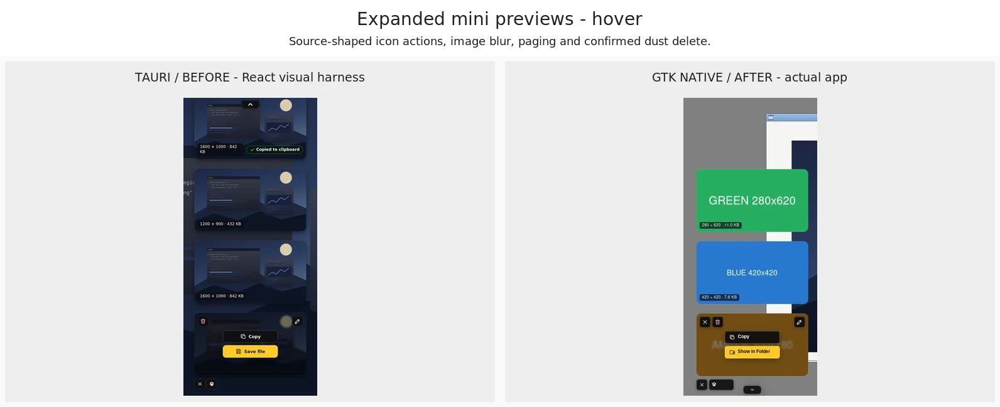

The [native dust clip](images/native-ui/native-dust.mp4) exercises confirmed GTK
deletion; the [Tauri clip](images/native-ui/tauri-dust.webm) triggers its browser
harness action. They show the effects, not equal animation FPS. Native cards use
asymmetric colored fixtures so incorrect file/card identities are detectable.

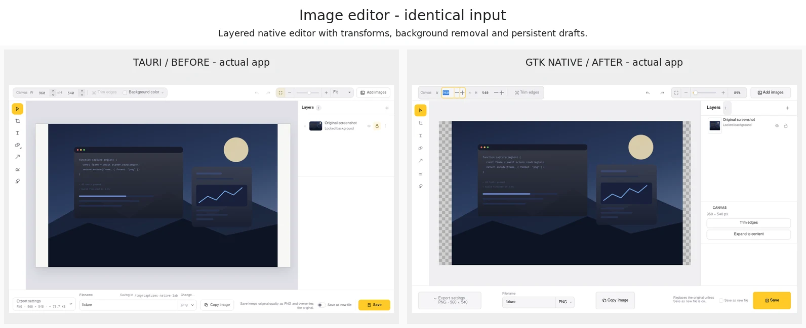
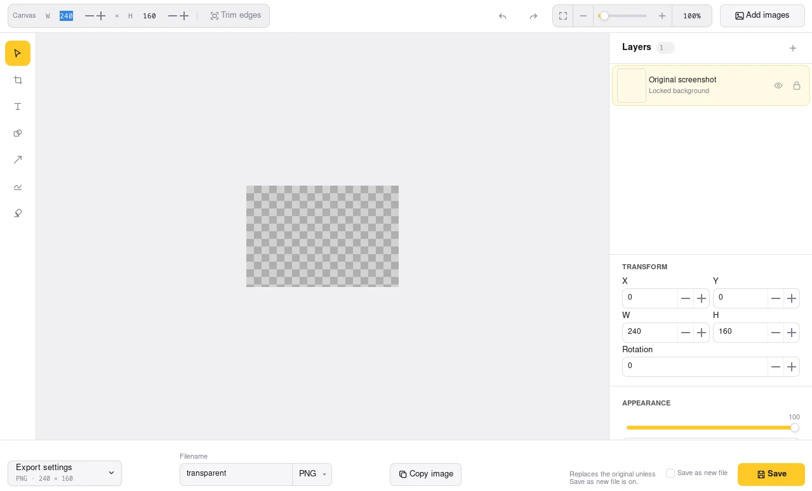
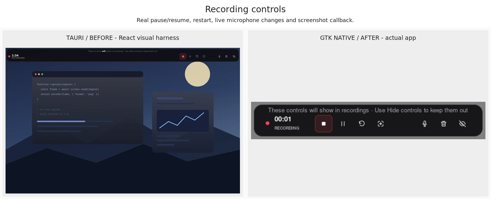
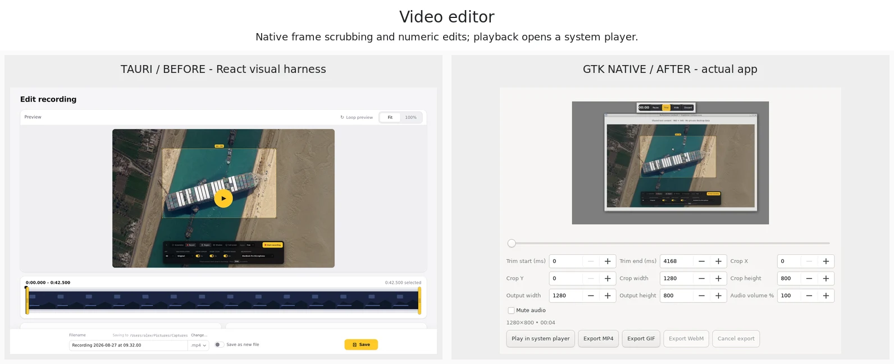
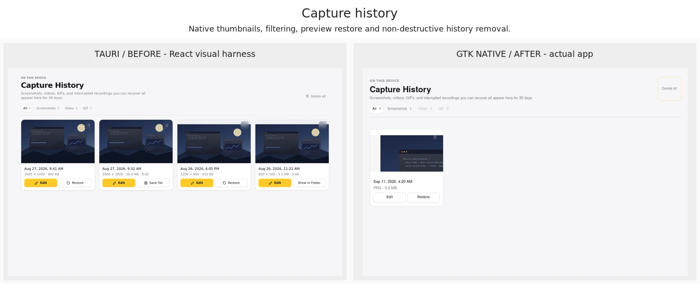
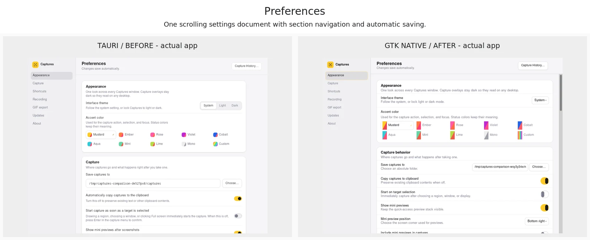

The lab uses Xvfb/Openbox and `xcompmgr -n` for normal alpha compositing. Its `-c`
synthetic-shadow mode produced large rectangular shadows around sparse RGBA
overlays, despite 32-bit client/frame visuals. No synthetic compositor shadows
are used for either app in the final measurements. This does not establish correct
GNOME/KDE compositor behavior; those desktops still need direct validation.

## Measurements: frontend overhead, not a complete migration forecast

[Raw measurements](../experiments/native-ui/results/linux-native-features.json)
include every sample, binary sizes/hashes and input hashes. The Tauri comparator
is a release source build at
[2113ac2](https://github.com/joswayski/captures/commit/2113ac2cad3ab4d488409a4bfd7ad4d159e4f5ec)
with the production asset protocol enabled. The packaged Preview requires a newer
glibc than this orb, so these are not installer/package measurements.

The original **46 ms / 18.6 MiB** figures belong only to the
[minimal probe](native-ui-evaluation.md), not this expanded build. Timing below is
**first mapped target window, not content readiness**.

11 September 2026; medians recomputed independently from all 20 samples. These
measurements precede the follow-up control-styling refinement; the refreshed gallery
is visual evidence, not a new benchmark run:

| Metric | Tauri source app | Expanded native build |
| --- | ---: | ---: |
| Preferences process-tree PSS | 505.83 MiB | 38.20 MiB |
| Preferences PSS range | 496.37–509.98 MiB | 38.15–38.35 MiB |
| Image editor PSS, same 960×540 source | 600.57 MiB | 36.59 MiB |
| Image editor PSS range | 596.49–604.75 MiB | 34.75–36.80 MiB |
| Preferences first mapped window | 1,103.9 ms | 574.5 ms |
| Image editor first mapped window | 1,086.3 ms | 531.7 ms |
| Preferences sampled CPU, one-core scale | 15.5% | 0.0% |
| Image editor sampled CPU, one-core scale | 34.0% | 0.0% |
| Processes in either sampled state | 6 | 1 |
| Stripped executable, excluding libraries/media tools | 34.44 MiB | 11.59 MiB |

That is about **92–94% lower PSS** and **1.9–2.0× faster window mapping** in these
states—not a 46-ms launch claim or a 10× complete-application speedup. The native
executable grew from 8.53 MiB in the earlier partial implementation as functionality
was added. The complete Linux product still has the replacement blockers below.

Method: Debian 12, 1280×800 Xvfb, software graphics, two virtual CPUs. Fresh profile
each trial; one unmeasured visual warmup, then five alternating trials per app/state.
Memory is sampled five seconds after mapping, followed by a two-second CPU sample.
Both apps use verified 980×720 Preferences and 1280×760 editor client areas. The
lab removes window-manager decoration constraints and resizes after the mapping
timestamp, before settling; otherwise Openbox clips a full-width GTK client.
No builds, browser automation or UI tests run concurrently with measurement.
PSS apportions shared memory; RSS would double-count pages across WebKit processes.
X server, desktop services, kernel/GPU allocations and filesystem cache are excluded.

The Tauri process tree includes startup-created hidden webviews. The native UI now
does more work than the earlier prototype, but workload/feature coverage is still
not identical. Binary size excludes GTK/WebKit, FFmpeg and other dynamic libraries.
Short idle/settling CPU is not a battery measurement. Zero means below sampling
resolution, not no work. The Rust capture/media engines are shared: lower UI memory
does not establish faster screenshot capture or video encoding.

No valid matched recording-throughput, export-throughput, animation-FPS, cold-start
or energy benchmark is available. Actual Tauri video playback previously returned
`NotSupportedError` in this orb even with decoder packages installed; that failing
player is excluded rather than counted as a native performance win. Linux results
must not be extrapolated to macOS or Windows.

## Tradeoffs and replacement blockers

**Benefits:** no webview in the native binary, reuse of Rust backend code, real GTK
controls/accessibility, and custom stacking/particles alongside significantly lower
memory in measured states. AI-assisted maintenance of three frontends is a reasonable
product choice; duplicated implementation effort is not a reason to reject it outright.

**Costs:** GTK widgets do not automatically reproduce React behavior or styling.
Custom canvases need their own interaction and accessibility tests. GTK3 is a
practical experiment foundation because the existing Linux stack already depends
on it; a longer-term GTK4 or Qt choice would need its own platform work. Three
frontends still require tested shared behavior contracts, packaging, permissions,
updates and actual platform hardware, regardless of who writes the code.

**Remaining UI differences:** the image editor retains secondary layer properties
in a scrolling sidebar rather than moving all of them into the source per-layer
menus. GTK selects, sliders and text rendering remain platform-native. Recording
source overwrite is intentionally unavailable (new-file output only), and live
microphone peaks are not measured. History metadata and some Preferences options
are limited by the experiment's independent data model. Recording compression
comparison is explicitly requested rather than automatically re-encoded on every
paused playhead/quality change. Matching the measured layout does not certify
identical interaction architecture or accessibility.

**Still blocks replacement:** Wayland (native currently rejects it), native
installer/updater/file associations/onboarding, production data migration, full
keyboard/screen-reader and pixel/gesture fidelity validation, and GNOME/KDE,
multi-monitor/HiDPI, real audio devices and long recording sessions. WebM export
and reliable Linux recording-window exclusion are also unavailable in the reused
shipping media/platform paths. Keep Tauri shipping; do not present this as full
parity or start the other OS rewrites on the strength of memory numbers alone.

## Verification

See [DEVELOPMENT.md](../DEVELOPMENT.md#optional-native-ui-experiment) for commands.

- Repository gate `npm run check` passed with command-local `commit.gpgsign=false`
  for temporary Git-fixture commits; no global signing configuration was changed.
- Workspace Rust formatting, tests and Clippy passed. One normally ignored
  database integration test was not counted as passed.
- Standalone locked release build, formatting, 51 native tests plus two original
  probe tests, and Clippy with `-D warnings` passed without dead-code suppression.
- `native_check.py` runs current capture/preferences, image-editor, pointer-preview,
  history and recording checks sequentially. The combined suite passed, including
  exact screenshot pixels, source Save/drafts, transparent output, external file
  drag, direct video crop/trim, pointer/keyboard comparison, physical icon-button
  input, chosen-folder media export and startup recording recovery. The shared
  SVG icon widget is windowless so it cannot intercept its host button's clicks.
- Final affected native light/dark surfaces, checkerboard, preview stack, HUD and
  direct-manipulation editor were rendered and inspected. Named AT-SPI controls
  were used by the tests; this is not a complete screen-reader certification.
- Not verified: Wayland, physical multi-monitor/HiDPI, GNOME/KDE panels/lock screens,
  hardware audio/GPU, long-session AV synchronization, distribution packages,
  Windows or macOS. No release or deployment was performed.
