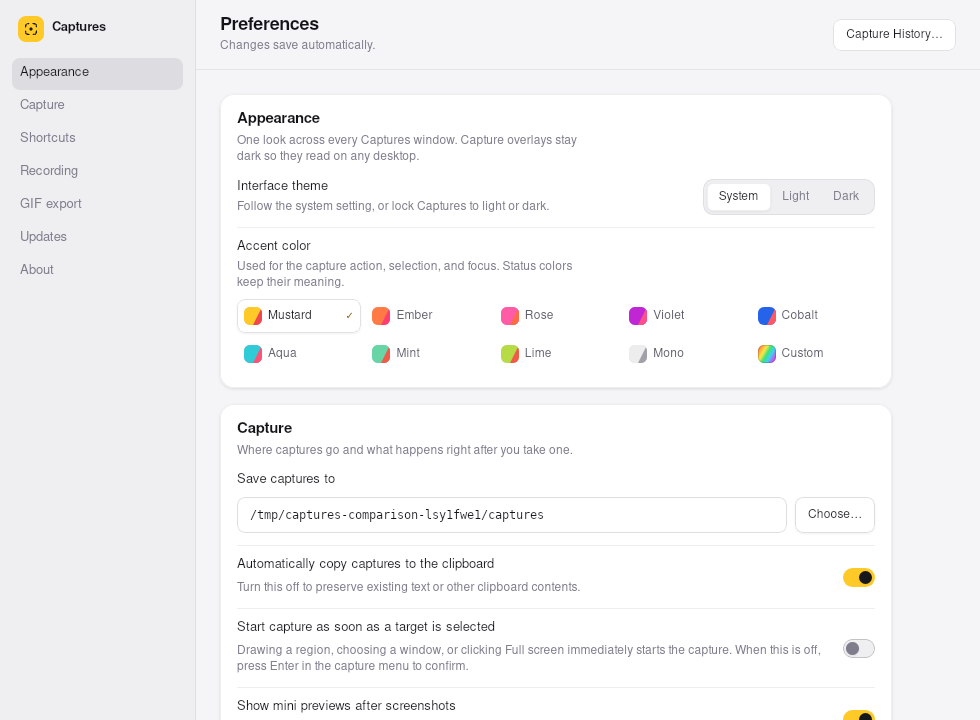
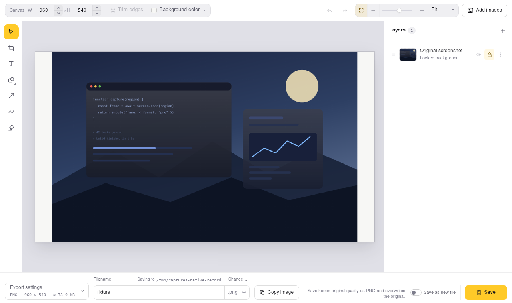
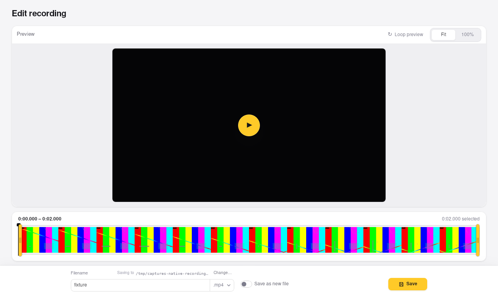

# Captures shipping-main UI reference — 2026-09-13

This set records the shipping Captures React UI from exact remote `main` commit
[`4fd828f4af58d6b3b389e7955d84640222c58411`](https://github.com/joswayski/captures/commit/4fd828f4af58d6b3b389e7955d84640222c58411), captured on 2026-09-13. The source was the detached checkout at
`/home/user/workspace/captures-main-reference`, not the uncommitted
`amp/native-platforms` integration checkout where these reference files live.

## Reference images

Images 01–07 are **main React dev harness** captures, not desktop-app evidence.
The harness uses the exact main source's real React components and documented
mocked backend (`?mock=1`), with `platform=linux`. Images 08–10 are the **actual
Tauri desktop app**, built from the same pinned source and run in an isolated
Linux X11 session. All images are lossless WebP; they preserve the captured state,
including scroll boundaries and environment limitations, rather than retouching it.

| File | Render mode | Fixture/mock state |
| --- | --- | --- |
| `01-preferences-light.webp` | main React dev harness | Mock settings; explicit light appearance |
| `02-preferences-dark.webp` | main React dev harness | Mock settings; explicit dark appearance |
| `03-screenshot-editor-layers.webp` | main React dev harness | Mock 1600×1000 SVG desktop capture and one populated layer |
| `04-recording-editor-media.webp` | main React dev harness | Mock recording metadata/filmstrip plus a disposable six-second local MP4 test pattern |
| `05-history.webp` | main React dev harness | Mock screenshot, video, and GIF history entries |
| `06-recording-selector.webp` | main React dev harness | Mock recording selection over the documented staged desktop |
| `07-recording-controls.webp` | main React dev harness | Mock active recording HUD over the documented staged desktop |
| `08-tauri-preferences.webp` | actual main Tauri, 980×720 | Disposable settings/profile; top of scrollable Preferences |
| `09-tauri-screenshot-editor.webp` | actual main Tauri, 1280×760 | Real 960×540 fixture PNG; original background layer and save controls |
| `10-tauri-recording-editor-initial.webp` | actual main Tauri, 1280×760 | Real two-second MP4; initial paused editor, populated filmstrip but black preview (not playback acceptance) |

### Actual desktop reference

### Additional harness surfaces

[Light Preferences](01-preferences-light.webp) · [Dark Preferences](02-preferences-dark.webp) ·
[Screenshot editor](03-screenshot-editor-layers.webp) · [Recording editor](04-recording-editor-media.webp) ·
[History](05-history.webp) · [Recording selector](06-recording-selector.webp) ·
[Recording controls](07-recording-controls.webp)

## Capture provenance and workflow

- Browser: orb Chromium driven by `agent-browser`, unique session `mainref`.
- Viewport: 1280×800 CSS pixels at device scale factor 2; resulting files are
  2560×1600 pixels.
- Server: pinned checkout's documented Vite harness, launched as supervised orb
  service `captures-main-ref-web` with
  `npm run dev --workspace @captures/desktop -- --host 127.0.0.1 --port 1437`.
- Dependencies: the pinned checkout temporarily reused the integration checkout's
  compatible root `node_modules` through a symlink. `npm run build --workspace
  @captures/desktop` completed successfully before capture (TypeScript and Vite
  production build, 67 modules transformed).
- Routes: `?view=preferences`, `screenshot-editor`, `recording-editor`, `history`,
  `recording-selector`, and `recording-hud`, each with `mock=1`; overlay routes also
  used `stage=1`. Appearance was selected through the documented
  `captures-appearance` local-storage value. The selector's **Record** control was
  activated before capture.
- Recording fixture command:
  `ffmpeg -f lavfi -i testsrc2=size=800x500:rate=30 -t 6 -threads 2 -c:v libx264 -pix_fmt yuv420p apps/desktop/ui/public/dev-sample.mp4`.
  The ignored fixture was deleted after capture.
- Screenshots were captured as PNG, individually inspected, then converted with
  ImageMagick lossless WebP (`-define webp:lossless=true -define webp:method=6`).
  Inspection confirmed populated, readable controls; correct light/dark Preferences;
  media and layers in the screenshot editor; decoded media and timeline in the
  recording editor; populated History; and visible selector/HUD without blank or
  error states.

## Actual desktop capture workflow

The exact-source Tauri build completed successfully after an interrupted initial
attempt: `CARGO_BUILD_JOBS=2 cargo build --release --locked -p captures-desktop
--features tauri/custom-protocol`, using the shared Rust target cache. The build
used the pinned checkout's production frontend, not the Vite harness.

`experiments/linux-native/native_comparison.py::trial` launched the built binary
in a fresh temporary HOME/XDG profile for each state, with onboarding completed,
launch-at-login disabled and proxies pointed at a closed local port. It passed
the fixture path as a positional argument for each editor. Xvfb/Openbox provided
a 1600×1000 display; ImageMagick captured the exact client windows at 1× after
ten seconds of settling. Preferences used 980×720; both editors used 1280×760.
The PNG fixture came from the main React harness artwork; the MP4 was generated
with `ffmpeg -f lavfi -i testsrc2=size=960x540:rate=15 -t 2 -threads 2
-pix_fmt yuv420p fixture.mp4`.

## Limitations

Preferences images capture the top of a scrollable page, not all settings at
once. Harness editor text can ellipsize at the captured viewport. Its recording
metadata is mocked (42.5 seconds) independently of the six-second media fixture;
the selector's microphone name is also mock data, not detected Linux hardware.
The HUD's staged desktop ends above the viewport bottom, leaving a dark band.

The actual Tauri recording editor opened and generated a two-second filmstrip,
but its initial preview remained black. This image records that limitation; it
does not establish decoded preview/playback acceptance. Harness video rendering
does not resolve the Tauri/WebKit limitation.

These references make no physical macOS/Windows, mixed-DPI, Wayland, system-theme,
capture-permission or real recording/audio claims. They document shipping-main
React/Tauri UI, not the experimental GTK4, AppKit or Win32 frontends. All data
and media are disposable fixtures; no production profile or user data was used.
