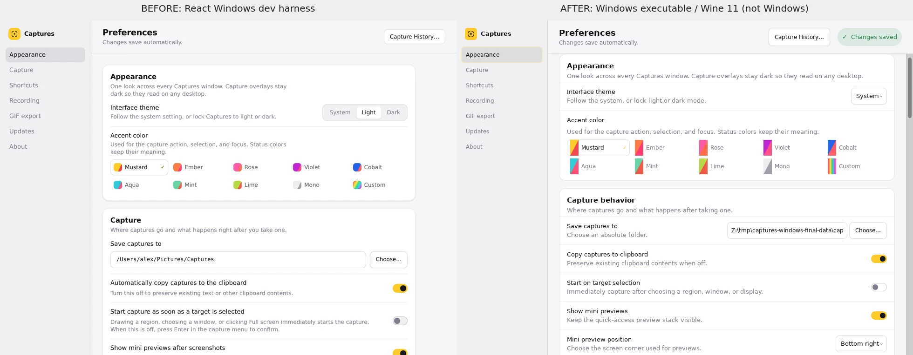
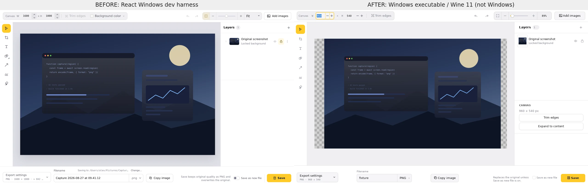

# Windows-native experiment

The Windows executable ports the full [Linux-native implementation](linux-native-implementation.md)
from PR #512, using the **same Rust/GTK3 widget tree, Cairo drawing, theme rules,
preview-stack effects and animation code**. It does not embed React, Tauri or
WebView2. This is a portable experiment for testing, not a shipping replacement;
the Tauri app and Preview pipeline are unchanged. macOS native work is out of scope.

## What carries over and what is Windows-specific

Shared surfaces include screenshot/video/GIF targeting, animated mini previews,
layered image and canvas editing, image encoders and drafts, the recording HUD,
video/GIF editing, history, preferences and interrupted-recording recovery. The
Linux report describes those features and their inherited limitations in detail.
Sharing their implementation avoids a second independently styled frontend; it
does not establish pixel-identical rendering or feature parity with Tauri.

Windows integration adds a tray menu, native global shortcuts (including the
existing Win+Shift+S interceptor), same-profile command forwarding, opt-in HKCU
login startup, system appearance detection and isolated Local AppData storage.
Capture coordinates use GTK's scale and physical desktop bounds, including
negative monitor origins. Capture overlays and recording controls use Win32
capture exclusion; overlay failure cancels capture rather than proceeding with
an unsafe overlay. Recording-control inclusion is a Windows preference. Private
draft directories use Windows ACLs and reject reparse-point directory targets;
file handles close before atomic publication.

The portable packager includes GTK, its recursive DLL/plugin dependencies,
FFmpeg/ffprobe/ffplay, schemas, icons and font configuration. The executable sets
runtime paths itself so direct launch and login startup do not require a shell
wrapper. It has no installer, updater, signing or file associations. Available
dependency license texts are included, but public redistribution still needs a
complete license and corresponding-source audit.

## Before/after evidence is not a Windows parity certification

These are actual rendered interfaces, not generated mockups. **Before** is the
React dev harness with `platform=windows`, running in Chromium on Linux, not a
Windows Tauri screenshot. **After** is the release Windows PE executable running
under Wine 11 in an isolated Xvfb/Openbox session. Wine required FreeSans fonts
and `PANGOCAIRO_BACKEND=fc` for legible text; the app does not force that backend
on Windows. Neither environment proves Windows font, DPI or compositor behavior.

Preferences uses matched 980×720 client areas. Editor areas are 1280×760; both
show the harness's neutral illustration, but the native input is its 960×540
raster while the React fixture advertises a 1600×1000 canvas. Therefore the editor
comparison is a layout reference, not an equal-input pixel comparison or a
benchmark. Chromium captures were reduced from 2× to 1× for these labelled pairs.

Inspection confirms readable navigation, appearance controls, editor tools,
layers and Save controls. Visible differences remain: GTK theme selection is a
dropdown rather than segmented controls, card spacing and switches differ, and
the editor shows additional canvas properties and different canvas framing.
The shared preview animation code is unchanged; Windows animation smoothness,
hover/focus behavior and transparent-window compositing have not been measured.

## Verification performed in the Linux orb

- Optimized `x86_64-pc-windows-gnu` build succeeds with Rust 1.94 and MSYS2
  GTK 3.24.52. Native-only build excludes the optional Tauri probe dependencies.
- Portable package dependency inspection resolves 118 non-system DLLs, including
  SVG loader dependencies. A per-file SHA-256 manifest accompanies the folder.
- The Windows executable launches Preferences and opens an image through a
  second same-profile invocation under Wine 11. Rendered comparisons were inspected.
  Recording-control inclusion was toggled both ways, with persisted JSON values
  and rendered off/on states checked. Preferences switches are vertically centered
  rather than stretched to their description row's height on both native platforms.
- Native Linux unit tests: **54 passed**. Windows unit-test executable under
  Wine: **54 passed**, including image encoding, media trim/crop/export,
  draft/atomic-write behavior and asymmetric coordinate boundaries. Unix-only
  filesystem tests do not establish Windows ACL enforcement.
- `npm run check`, `cargo fmt --all -- --check`, `cargo test --workspace`, and
  workspace Clippy with `-D warnings` pass. The npm gate needed a command-local
  `commit.gpgsign=false` override for its disposable Git test repositories.
- Standalone native workspace formatting and Linux/Windows native all-targets
  Clippy pass. PowerShell 7 parses the benchmark and its process-tree traversal
  passes a synthetic functional check; the full Windows benchmark has not run.

## Performance results are pending Windows testing

There are **no measured Windows startup, RAM, CPU or animation results yet**.
Linux numbers from the earlier experiment and Wine process statistics would not
answer the Windows comparison. Cross-compilation time and package size are not
application performance benchmarks.

The included [PowerShell benchmark](../experiments/native-ui/windows/benchmark.ps1)
compares actual Windows Tauri/native executables in alternating trials, at matched
client sizes, with one identical editor input. It records raw visible-window
startup times, process-tree private bytes/working set and idle CPU, screenshots,
hashes and failed trials. WebView subprocesses are included. Profiles are reused
within a run; these are warm launches, not cold boots. Window visibility does not
mean the UI finished rendering. It does not measure animation FPS.

**Run benchmarks only in a disposable Windows account or VM.** Tauri resolves
Windows Known Folders directly; changing APPDATA in a child environment does not
isolate existing user data. The script refuses known existing Captures profiles
and processes. See the [build, launch and benchmark instructions](../experiments/native-ui/windows/README.md).

## Windows acceptance checklist and replacement blockers

For ordinary manual testing, quit Tauri to avoid shortcut conflicts, extract the
whole folder and run `bin/captures-windows-native.exe`. Test on copies: image
**Save** overwrites the opened source; Export writes a new file. Native settings
and history live under `%LOCALAPPDATA%\captures-windows-native` independently of
the shipping app. Disable login startup before moving/removing the folder.

Still requires actual Windows 11 testing:

- Capture all targets on mixed-scale/negative-origin monitors; check crop pixels,
  cursor placement, freeze/live behavior and Escape cancellation.
- Verify Win+Shift+S/Print Screen combinations, tray actions, login startup,
  clipboard, drag/drop, file reveal and repeated command activation.
- Exercise preview stacking/expansion/deletion animations, transparent margins and
  click-through. GTK3's Win32 backend does not implement the X11 input-region API;
  transparent-area click-through is a known parity risk, not verified support.
- Verify recording capture exclusion on hardware, controls explicitly included,
  pause/restart/mic changes, audio sync and lock/disconnect recovery.
- Exercise light/dark/system appearance, keyboard focus, accessibility and Windows
  text rendering. Inspect benchmark images for occlusion before comparing results.

Inherited Linux gaps also remain: some secondary layer properties, continuous
preview gravity/drag sway, full history metadata/archived snapshots, microphone
peak metering, recording-source overwrite and the native WebM export path. Native
GTK/Cairo effects are not identical to browser filters. No production history
migration, native update channel or claim of complete styling/animation parity is
included. These blockers must be addressed before replacing the shipping app.
